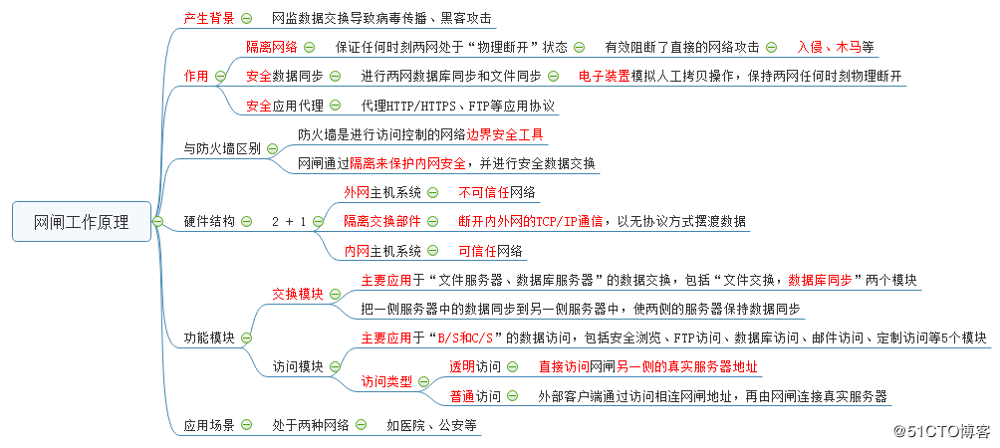

# 网闸

> [什么是网闸,从网闸的原理进行解读 - 四海骄阳](https://www.cnblogs.com/zhoading/p/8831170.html)
> [安全隔离网闸](https://wenku.baidu.com/view/8f2cc1fb770bf78a6529540d.html)
> [启明星辰网闸配置步骤](https://blog.51cto.com/maguangjie/2097081)

## 简介

网闸的全称是安全隔离与信息交换系统，英文名为 GAP。
是使用一种专用的隔离芯片在电路上切断内外网连接的一种设备，并能够在网络间进行安全适度的应用数据交换。
由于两个独立的主机系统通过网闸进行隔离，使系统间不存在通信的物理连接、逻辑连接及信息传输协议，不存在依据协议进行的信息交换，而只有以数据文件形式进行的无协议摆渡。
因此，网闸从逻辑上隔离、阻断了对内网具有潜在攻击可能的一切网络连接，使外部攻击者无法直接入侵、攻击或破坏内网，保障了内部主机的安全。

## 历史

Michael Bobbin说，“保证一个系统真正安全的途径只有一个：断开网络，这也许正在成为一个真正的解决方案”。
在政府、国防、能源等很多重要领域，对数据机密性、网络平稳性、业务连续性要求极高，坚如磐石的安全保障尤其关键。
市场需求催生了安全技术的创新，在上世纪90年代中期俄罗斯人Ry Jones首先提出“AirGap”隔离概念，
然后，以色列研制成功物理隔离卡，实现网络之间的安全隔离；
其后，美国Whale Communications公司和以色列SpearHead公司先后推出了e-Gap和NetGap产品，
利用专有硬件实现两个网络在不连通的情况下数据的安全交换和资源共享，
从而使安全隔离技术从单纯实现“网络隔离禁止交换”发展到“安全隔离和可靠、可控交换”。
