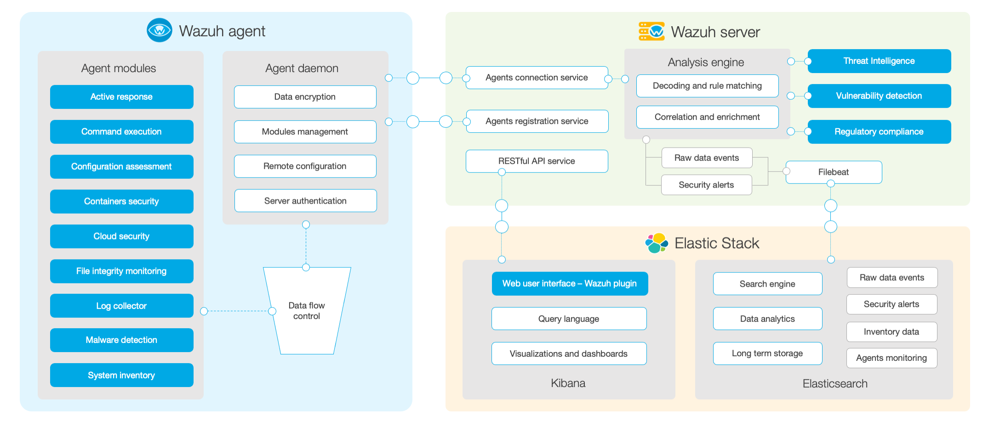
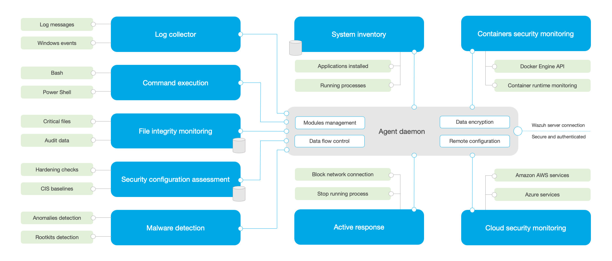
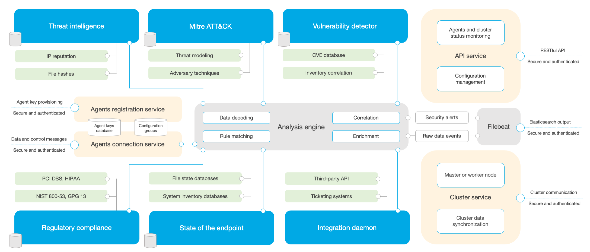
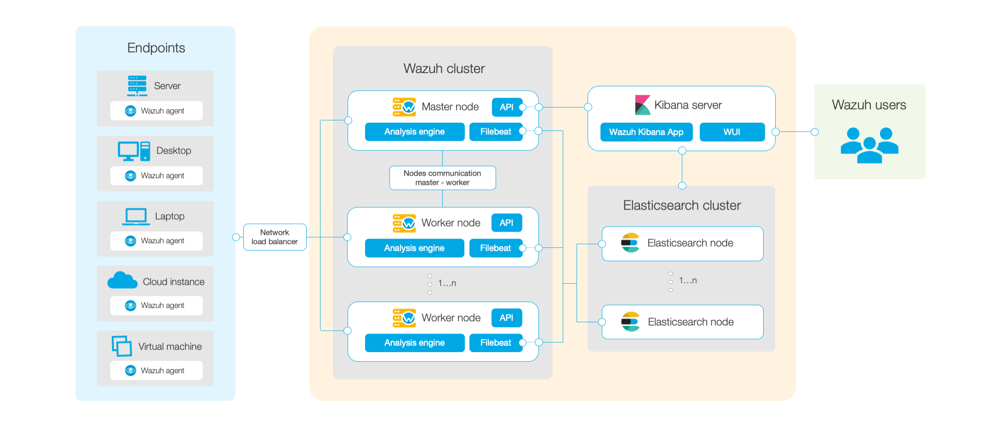

# Wazuh 入门

Wazuh是一个免费的开源平台，用于威胁的预防，检测和响应。它可在本地，虚拟化，容器化和基于云的环境中保护工作负载。从小型企业到大型企业，Wazuh在全球成千上万的组织中得到广泛使用。 Wazuh解决方案由部署到受监视系统的端点安全代理和管理服务器组成，该管理服务器收集和分析代理收集的数据。此外，Wazuh已与Elastic Stack完全集成，提供了搜索引擎和数据可视化工具，使用户可以浏览其安全警报。

## 社区与支持

Wazuh拥有世界上最大的开源安全社区之一。您可以成为其中的一部分，以向其他用户学习，参与讨论，与我们的开发团队交谈并为该项目做出贡献。以下资源很容易获得： 

- [Slack频道](https://wazuh.com/community/join-us-on-slack/)：加入我们的社区频道，与我们的开发人员和技术团队进行实时聊天。 

- [Google网上论坛](https://groups.google.com/g/wazuh)：您可以在这里分享问题并向其他Wazuh用户学习。通过电子邮件订阅很容易。 

- [GitHub]([https://github.com/wazuh)：获得Wazuh源代码的访问权限，报告问题并为该项目做贡献。我们很乐意审核并接受请求请求。 
  
  此外，我们还提供[专业的支持，培训和咨询服务](https://wazuh.com/professional-services/)。

## 组件(Components)

Wazuh平台提供的功能可保护您的云，容器和服务器工作负载。其中包括日志数据分析，入侵和恶意软件检测，文件完整性监视，配置评估，漏洞检测以及对法规遵从性的支持。 Wazuh解决方案基于以下三个组件： 

- [Wazuh agent](#Wazuh-Agent)：安装在便携式计算机，台式机，服务器，云实例或虚拟机等端点上，它提供预防，检测和响应功能。它支持Windows，Linux，MacOS，HP-UX，Solaris和AIX平台。

- [Wazuh server](#Wazuh-server)：它分析从代理接收到的数据，通过解码器和规则对其进行处理，并使用威胁情报来查找众所周知的危害指标（IOC）。一台服务器可以分析来自成百上千个代理的数据，并且在设置为集群时可以水平扩展。该服务器还用于管理代理，在必要时进行远程配置和升级。 

- [Elastic Stack](#Elastic-Stack)：它索引并存储由Wazuh服务器生成的警报。此外，Wazuh和Kibana之间的集成为数据的可视化和分析提供了强大的用户界面。此界面还用于管理Wazuh配置并监视其状态。 除了基于代理的监视功​​能外，Wazuh平台还可以监视无代理设备，例如防火墙，交换机，路由器或网络IDS等。例如，可以通过Syslog收集系统日志数据，并可以通过定期探测其数据（例如，通过SSH或通过API）来监视其配置。 下图显示了Wazuh组件和数据流。它显示了解决方案的三个主要组件，分别是Wazuh代理，Wazuh服务器和ES。



### Wazuh Agent

Wazuh代理可在Linux，Windows，macOS，Solaris，AIX和其他操作系统上运行。它可以部署到笔记本电脑，台式机，服务器，云实例，容器或虚拟机。它提供了威胁预防，检测和响应功能。它也用于收集不同类型的系统和应用程序数据，并通过加密并经过身份验证的通道将其转发到Wazuh服务器。

#### Agent 架构

Wazuh代理具有模块化架构，其中不同组件负责各自的任务：监视文件系统，读取日志消息，收集清单数据，扫描系统配置，查找恶意软件等。用户可以通过配置启用或禁用代理模块设置，使解决方案适应其特定的用例。 下图显示了代理架构和组件：



#### Agent 模块

所有代理模块都有不同的用途和设置。这是他们所做的简短描述： 

- **日志收集器**(Log collector)：此代理组件可以读取平面日志文件和Windows事件，收集操作系统和应用程序日志消息。它确实支持Windows事件的XPath过滤器，并且可以识别多行格式（例如Linux审核日志）。它还可以使用其他元数据来丰富JSON事件。 

- **命令执行**(Command execution)：代理可以定期运行授权命令，收集其输出并将其报告回Wazuh服务器以进行进一步分析。该模块可用于满足不同目的（例如，监视剩余的硬盘空间，获取上次登录用户的列表等）。 

- **文件完整性监视**（FIM:File integrity monitoring)：此模块监视文件系统，并在创建，删除或修改文件时报告。它跟踪文件属性，权限，所有权和内容。事件发生时，它将实时捕获谁，什么以及何时进行详细信息。此外，该模块使用受监视文件的状态构建和维护数据库，从而允许远程运行查询。 

- **安全配置评估**(SCA:Security configuration assessment)：此组件利用基于Internet安全中心（CIS）基准的即用型检查提供连续的配置评估。用户还可以创建自己的SCA检查以监视和实施其安全策略。 

- **系统清单**(System inventory)：此代理模块定期运行扫描，收集清单数据，例如操作系统版本，网络接口，运行的进程，已安装的应用程序以及打开的端口列表。扫描结果存储在本地SQLite数据库中，可以远程查询。 

- **恶意软件检测**(Malware detection)：使用基于非签名的方法，此组件能够检测异常和rootkit的可能存在。监视系统调用，它将查找隐藏的进程，隐藏的文件和隐藏的端口。 

- **主动响应**(Active response)：检测到威胁时，此模块将自动执行操作。它尤其可以阻止网络连接，停止正在运行的进程或删除恶意文件。用户也可以在必要时创建自定义响应（例如，在沙盒中运行二进制文件，捕获网络连接流量，使用防病毒软件扫描文件等）。 

- **容器安全监控**(Containers security monitoring)：此代理模块与Docker Engine API集成在一起，以监视容器化环境中的更改。例如，它检测到容器映像，网络配置或数据量的更改。此外，它还会警告以特权模式运行的容器以及正在运行的容器中执行命令的用户。 

- **云安全监控**(Cloud security monitoring)：此组件监视云提供程序，例如Amazon AWS，Microsoft Azure或Google GCP。它与它们的API进行本地通信。它能够检测到云基础架构的更改（例如，创建新用户，修改安全组，停止云实例等），并收集云服务日志数据（例如，AWS Cloudtrail，AWS Macie，AWS GuardDuty ，Azure Active Directory等）

#### 与 Wazuh Server 通信

Wazuh代理与Wazuh服务器进行通信，以便发送收集的数据和与安全相关的事件。此外，代理发送操作数据，报告其配置和状态。连接后，可以从Wazuh服务器远程升级，监视和配置代理。 Wazuh代理与服务器的通信通过安全通道（TCP或UDP）进行，实时提供数据加密和压缩。此外，它包括流控制机制，可避免泛洪，在必要时对事件进行排队并保护网络带宽。 <mark>在第一次将Wazuh代理连接到服务器之前，必须先注册Wazuh代理。此过程为代理提供了唯一的预共享密钥，该密钥用于身份验证和数据加密</mark>。

### Wazuh Server

Wazuh服务器组件负责分析从代理接收的数据，并在检测到威胁或异常时触发警报。它还用于远程管理代理配置并监视其状态。 Wazuh服务器使用威胁情报源来提高其检测能力。它还利用法规遵从性要求（例如PCI DSS，HIPAA，NIST 800-53…）和Mitre ATT＆CK框架来丰富警报数据，从而提供有关警报的有用上下文。 另外，Wazuh服务器可以与外部软件集成，例如票务系统（例如Service Now，Jira，PagerDuty）和即时消息传递平台（例如Slack）。这可简化安全操作。

#### Server 架构

Wazuh服务器运行分析引擎，Wazuh RESTful API，代理注册服务，代理连接服务，Wazuh集群守护程序和Filebeat。下图表示服务器体系结构和组件：



#### Server 服务

服务器通常在独立的物理机，虚拟机，docker容器或云实例上运行。它安装在Linux操作系统上。以下是主要服务器组件的列表： 

- **代理注册服务**(Agents registration service)：用于通过供应和分配每个代理唯一的预共享身份验证密钥来注册新代理。此过程作为网络服务运行，并支持通过TLS/SSL证书或提供固定密码进行身份验证。 

- **代理连接服务**(Agents connection service)：这是从代理接收数据的服务。它利用预共享密钥来验证每个代理身份并加密代理与Wazuh服务器之间的通信。此外，此服务用于提供集中的配置管理，能够远程推送新的代理设置。 

- **分析引擎**(Analysis engine)：这是执行数据分析的过程。它利用解码器来识别正在处理的信息的类型（例如Windows事件，SSHD日志，Web服务器日志等），并从日志消息中提取相关的数据元素（例如源IP地址，事件ID，用户名等）。 接下来，通过使用规则，它可以识别解码事件中的特定模式，这些特定模式可能会触发警报，甚至可能要求采取自动对策（例如，防火墙上的IP禁止）。 

- **Wazuh RESTful API**：此服务提供了与Wazuh基础结构进行交互的接口。它用于管理代理和服务器配置设置，监视基础结构状态和整体运行状况，管理和编辑Wazuh解码器和规则，以及查询受监视端点的状态。 Wazuh Web用户界面（Kibana应用程序）也使用它。 

- **Wazuh cluster daemon**：此服务用于水平扩展Wazuh服务器，将它们部署为群集。这种配置与网络负载平衡器相结合，可提供高可用性和负载平衡。 Wazuh集群守护程序是Wazuh服务器用来相互通信并保持同步的工具。 

- **Filebeat**：用于将事件和警报发送到Elasticsearch。它读取Wazuh分析引擎的输出并实时发送事件。当连接到多节点Elasticsearch集群时，它还提供负载平衡。 Wazuh剂弹性堆栈

### Elastic Stack

Elastic Stack是流行的开源项目的统一套件，用于日志管理，包括Elasticsearch，Kibana，Filebeat等。与Wazuh解决方案特别相关的项目是： 

- **Filebeat**：一种轻量级转发器，用于通过网络传送日志，通常将日志传送到Elasticsearch。在Wazuh服务器上使用它来将事件和警报发送到Elasticsearch。它读取Wazuh分析引擎的输出，并通过加密通道实时发送事件。当连接到多节点Elasticsearch集群时，它还提供负载平衡。 

- **Elasticsearch**：高度可扩展的全文本搜索和分析引擎。 Elasticsearch是分布式的，这意味着数据索引被分为多个分片，每个分片可以具有零个或多个副本。 Wazuh对警报数据，原始事件和状态监视信息使用不同的索引。 

- **Kibana**：灵活直观的Web界面，用于挖掘，分析和可视化数据。它在Elasticsearch集群中的索引内容之上运行。 Wazuh Web用户界面已以插件的形式完全嵌入在Kibana中。它包括用于安全事件，法规遵从性（例如PCI DSS，GDPR，CIS，HIPAA，NIST 800-53）的现成仪表板，检测到的易受攻击的应用程序，文件完整性监控数据，配置评估结果，云基础架构监控事件， 和别的。
  
  Wazuh与Elastic Stack集成在一起，提供了已经解码的消息的提要，以供Elasticsearch进行索引，还提供了用于警报和日志数据分析的实时Web控制台。此外，在Kibana之上运行的Wazuh用户界面用于管理和监视Wazuh基础结构。 Elasticsearch索引是具有相似特征（例如某些公共字段和共享数据保留要求）的文档的集合。 Wazuh利用每天创建的多达三个不同的索引来存储不同的事件类型： 

- **wazuh-alerts**：Wazuh服务器生成的警报的索引。每次事件触发具有足够高优先级的规则（此阈值是可配置的）时，就会创建这些规则。 

- **wazuh-events**：无论是否执行规则，从代理收到的所有事件（存档数据）的索引。 

- **wazuh-monitoring**：一段时间内与Wazuh代理状态相关的数据的索引。 Web界面使用它来表示各个代理何时处于活动状态，已断开连接或从不连接。 

索引由文档组成。对于以上索引，文档是单独的警报，已归档的事件或与Wazuh代理状态相关的数据。 Elasticsearch索引分为一个或多个分片，每个分片可以选择具有一个或多个副本。每个主分片和副本分片都是一个单独的Lucene索引。因此，Elasticsearch索引由许多Lucene索引组成。在Elasticsearch索引上运行搜索时，将在所有分片上并行执行搜索，并合并结果。在多节点Elasticsearch集群中使用Elasticsearch索引划分为多个分片和副本，目的是扩大搜索范围并实现高可用性。单节点Elasticsearch集群通常每个索引只有一个分片，没有副本。

## Wazuh 架构

Wazuh体系结构基于在受监视的端点上运行的代理，这些代理将安全性数据转发到中央服务器。此外，支持无代理设备（例如防火墙，交换机，路由器，访问点等），并且可以通过Syslog，SSH或使用其自己的API主动提交日志数据。中央服务器对输入的信息进行解码和分析，并将结果传递给Elasticsearch集群以进行索引和存储。 

Elasticsearch集群是一个或多个节点的集合，这些节点相互通信以对索引执行读取和写入操作。不需要处理大量数据的小型Wazuh部署可以通过单节点群集轻松处理。当有大量受监视的端点，预期有大量数据或需要高可用性时，建议使用多节点群集。 

对于生产环境，建议将Wazuh服务器和Elasticsearch部署到不同的主机。在这种情况下，Filebeat用于使用TLS加密将Wazuh警报和/或存档的事件安全地转发到Elasticsearch群集（单节点或多节点）。 

下图显示了Wazuh部署架构。它显示了解决方案组件以及如何将Wazuh服务器和Elasticsearch配置为群集，从而提供负载平衡和高可用性。



### Wazuh Agent 和 Wazuh Server 间的通信

Wazuh代理将事件连续发送到Wazuh服务器以进行分析和威胁检测。为了开始运送它们，代理程序与服务器服务建立连接以进行代理程序连接，该服务侦听端口1514（这是可配置的）。然后Wazuh服务器使用分析引擎对接收到的事件进行解码和规则检查。触发规则的事件会增加警报数据，例如规则ID和规则名称。可以将事件假脱机到以下一个文件或两个文件中，具体取决于规则是否被执行：

- 文件 `/var/ossec/logs/archives/archives.json`包含所有事件，无论它们是否违反规则。 

- 文件`/var/ossec/logs/alerts/alerts.json`仅包含以足够高的优先级（阈值可配置）使规则中断的事件。 

Wazuh消息协议默认情况下使用AES加密，每个块具有128位和256位密钥（Blowfish加密也是可选的）。

> Read the [Benefits of using AES in Wazuh communications](https://wazuh.com/blog/benefits-of-using-aes-in-our-communications) document for more information.

### Wazuh server 和 Elastic Stack 间的通信

Wazuh服务器使用Filebeat通过TLS加密将警报和事件数据发送到Elasticsearch服务器。 Filebeat读取Wazuh服务器的输出数据并将其发送到Elasticsearch（默认情况下，监听端口9200 / TCP）。 Elasticsearch为数据建立索引后，将使用Kibana来挖掘和可视化信息。 Wazuh Web用户界面作为插件在Kibana内部运行。它查询Wazuh RESTful API（默认情况下，监听Wazuh服务器上的端口55000 / TCP），以显示Wazuh服务器和代理的配置和与状态有关的信息。如果需要，它还可以通过API调用修改代理或服务器配置设置。此通信使用TLS加密，并使用用户名和密码进行身份验证。

### 使用的端口

Wazuh组件的通信使用了几种服务。下面是这些服务使用的默认端口的列表。用户可以在必要时修改这些端口号

| Component     | Software      | Port      | Protocol             | Purpose                                      |
| ------------- | ------------- | --------- | -------------------- | -------------------------------------------- |
| Wazuh server  | Wazuh manager | 1514      | TCP (default)        | Agent 连接服务                                   |
|               |               | 1514      | UDP                  | Agent 连接服务                                   |
|               |               | 1515      | TCP                  | Agent 连接服务                                   |
|               |               | 1516      | TCP                  | Wazuh cluster daemon                         |
|               |               | 514       | UDP (default)        | Wazuh syslog collector (disabled by default) |
|               |               | 514       | TCP                  | Wazuh syslog collector (disabled by default) |
|               | Wazuh API     | 55000     | TCP                  | Wazuh RESTful API                            |
| Elastic Stack | Elasticsearch | 9200      | TCP                  | Elasticsearch RESTful API                    |
|               | Elasticsearch | 9300-9400 | TCP                  | Elasticsearch cluster communication          |
| Kibana        | 5601          | TCP       | Kibana web interface | Kibana web interface                         |

### 档案数据存储

档案数据存储 警报事件和非警报事件都存储在Wazuh服务器上的文件中，除了发送到Elasticsearch外。这些文件可以JSON格式（.json）和/或纯文本格式（.log-无解码字段，但更紧凑）编写。这些文件每天使用MD5，SHA1和SHA256校验和进行压缩和签名。目录和文件名结构如下：

```bash
root@wazuh-manager:/var/ossec/logs/archives/2020/Jan# ls -l
total 176
-rw-r----- 1 ossec ossec 234350 Jan  2 00:00 ossec-archive-01.json.gz
-rw-r----- 1 ossec ossec    350 Jan  2 00:00 ossec-archive-01.json.sum
-rw-r----- 1 ossec ossec 176221 Jan  2 00:00 ossec-archive-01.log.gz
-rw-r----- 1 ossec ossec    346 Jan  2 00:00 ossec-archive-01.log.sum
-rw-r----- 1 ossec ossec 224320 Jan  2 00:00 ossec-archive-02.json.gz
-rw-r----- 1 ossec ossec    350 Jan  2 00:00 ossec-archive-02.json.sum
-rw-r----- 1 ossec ossec 151642 Jan  2 00:00 ossec-archive-02.log.gz
-rw-r----- 1 ossec ossec    346 Jan  2 00:00 ossec-archive-02.log.sum
-rw-r----- 1 ossec ossec 315251 Jan  2 00:00 ossec-archive-03.json.gz
-rw-r----- 1 ossec ossec    350 Jan  2 00:00 ossec-archive-03.json.sum
-rw-r----- 1 ossec ossec 156296 Jan  2 00:00 ossec-archive-03.log.gz
-rw-r----- 1 ossec ossec    346 Jan  2 00:00 ossec-archive-03.log.sum
```

建议根据Wazuh服务器的存储容量旋转和备份存档文件。通过使用cron作业，您可以轻松地安排在服务器上仅在本地本地保留存档文件的某个时间窗口（例如，去年或过去三个月）。 另一方面，您可以选择完全放弃存储归档文件，而仅依靠Elasticsearch进行归档存储，尤其是如果您正在运行定期的Elasticsearch快照备份和/或具有分片副本的多节点Elasticsearch集群以实现高可用性。您甚至可以使用cron作业将快照索引移动到最终数据存储服务器，并使用MD5，SHA1和SHA256哈希算法对其进行签名。
