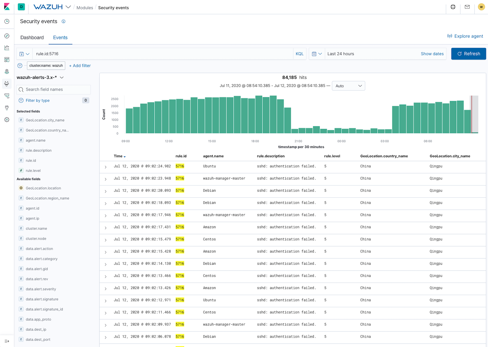

# 用例

Wazuh平台用于以不同方式保护和监视系统。由于其所有功能，它通常用于威胁预防，检测和响应。此外，Wazuh平台用于满足法规遵从性要求（例如PCI DSS或HIPAA）和配置标准（CIS加固指南）。 Wazuh是IaaS用户（例如Amazon AWS，Azure或Google云）中一种流行的安全解决方案，用于监视虚拟机和云实例。这是在系统级别利用Wazuh安全代理完成的，而在基础架构级别则是直接从云提供商的API中提取数据。 此外，Wazuh通常用于保护提供云原生运行时安全性的容器化环境。此功能基于与Docker引擎API和Kubernetes API的集成。此外，为了获得更好的保护，Wazuh安全代理可以在Docker主机上运行，​​从而提供了完整的威胁检测和响应功能。 在文档的此部分中，您将找到Wazuh解决方案的一些更常见用例的简短示例。

| 用例列表                                                     | 用例列表                                               |
| -------------------------------------------------------- | -------------------------------------------------- |
| 1.[Log data analysis](#日志数据分析(Log-data-analysis))        | 2.[File integrity monitoring](#file-integrity)     |
| 3.[Rootkits detection](#rootkits-detection)              | 4.[Active response](#active-response)              |
| 5.[Configuration assessment](#configuration-assessment)  | 6.[System inventory](#system-inventory)            |
| 7.[Vulnerability detection](#vulnerability-detection)    | 8.[Cloud security monitoring](#cloud-security)     |
| 9.[Containers security monitoring](#containers-security) | 10.[Regulatory compliance](#regulatory-compliance) |


## 日志数据分析(Log data analysis)

自动化的日志管理和分析可加速威胁检测。在许多情况下，可以在设备，系统和应用程序的日志消息中找到攻击的证据。 Wazuh可用于自动聚合和分析日志数据。 运行在受监视端点上的Wazuh代理通常负责读取操作系统和应用程序日志消息，并将其转发到进行分析的Wazuh服务器。如果未部署代理，则服务器还可以通过syslog从网络设备或应用程序接收数据。 Wazuh使用解码器来识别日志消息的源应用程序。然后，它使用特定于应用程序的规则分析数据。这是用于检测SSH身份验证失败事件的规则的示例：

```xml
<rule id="5716" level="5">
  <if_sid>5700</if_sid>
  <match>^Failed|^error: PAM: Authentication</match>
  <description>SSHD authentication failed.</description>
  <mitre>
    <id>T1110</id>
  </mitre>
  <group>authentication_failed,pci_dss_10.2.4,pci_dss_10.2.5,gpg13_7.1,gdpr_IV_35.7.d,gdpr_IV_32.2,hipaa_164.312.b,nist_800_53_AU.14,nist_800_53_AC.7,tsc_CC6.1,tsc_CC6.8,tsc_CC7.2,tsc_CC7.3,</group>
</rule>
```

规则包括一个`match`字段，用于定义规则将要查找的模式。还有一个`level`字段，用于指定结果警报的优先级。此外，规则还利用Mitre ATT＆CK框架中的技术标识符以及映射到法规遵从性控制来丰富事件。 每当代理之一或通过syslog收集的事件与优先级高于预定义阈值（默认值为3）的规则匹配时，管理器都会生成警报。 这是在`/var/ossec/logs/alerts/alerts.json`中找到的示例（为简洁起见，某些字段已删除）：

```json
  "agent": {
      "id": "005",
      "ip": "10.0.1.175",
      "name": "Centos"
  },
  "predecoder": {
      "hostname": "ip-10-0-1-175",
      "program_name": "sshd",
      "timestamp": "Jul 12 15:32:41"
  },
  "decoder": {
      "name": "sshd",
      "parent": "sshd"
  },
  "full_log": "Jul 12 15:32:41 ip-10-0-1-175 sshd[21746]: Failed password for root from 61.177.172.13 port 61658 ssh2",
  "location": "/var/log/secure",
  "data": {
      "dstuser": "root",
      "srcip": "61.177.172.13",
      "srcport": "61658"
  },
  "rule": {
      "description": "sshd: authentication failed.",
      "id": "5716",
      "level": 5,
      "mitre": {
          "id": [
              "T1110"
          ],
          "tactic": [
              "Credential Access"
          ],
          "technique": [
              "Brute Force"
          ]
      },
  },
  "timestamp": "2020-07-12T15:32:41.756+0000"
}
```

Wazuh服务器一旦生成警报，便会将警报发送到Elastic Stack组件，在其中将其丰富的地理位置信息进行存储和索引。然后，可以使用Kibana搜索，分析和可视化数据。以下是界面中显示的警报：




Wazuh提供了一个默认规则集，该规则集会定期更新，其中包含针对不同系统和应用程序的3,000多个规则。此外，Wazuh允许创建自定义规则。在用户手册中查找更多信息。
