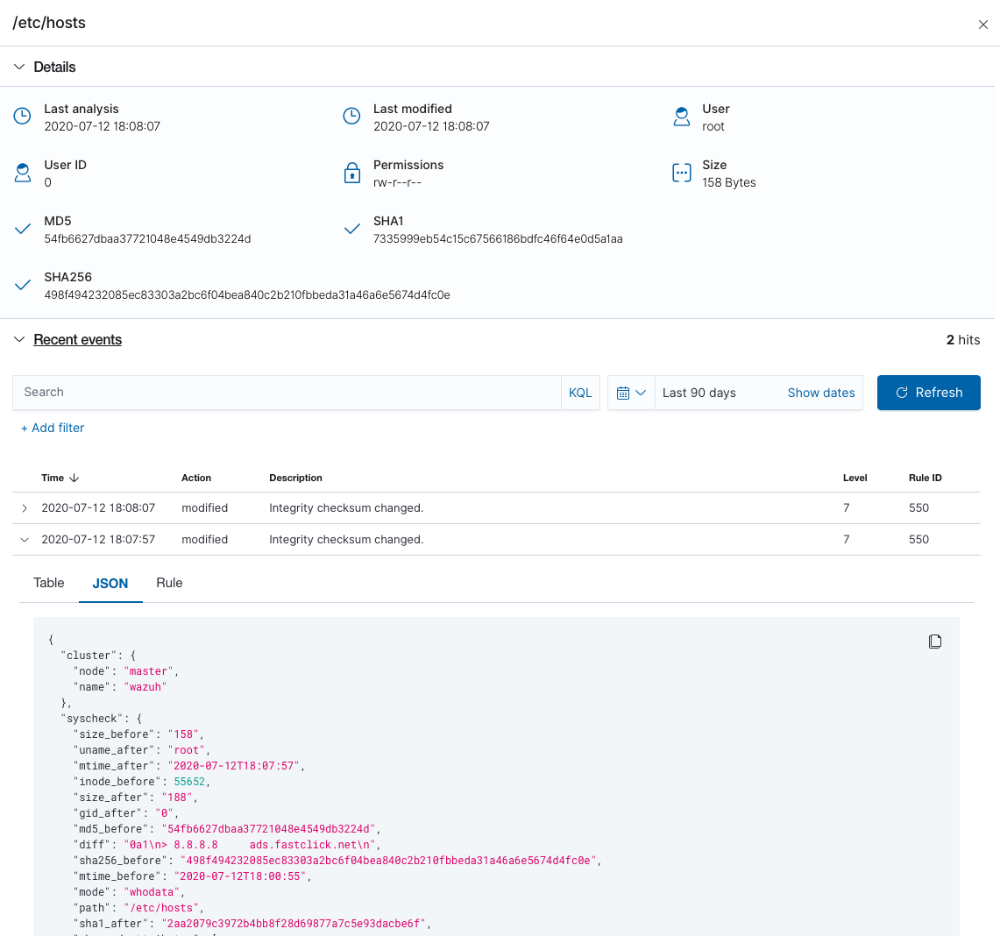
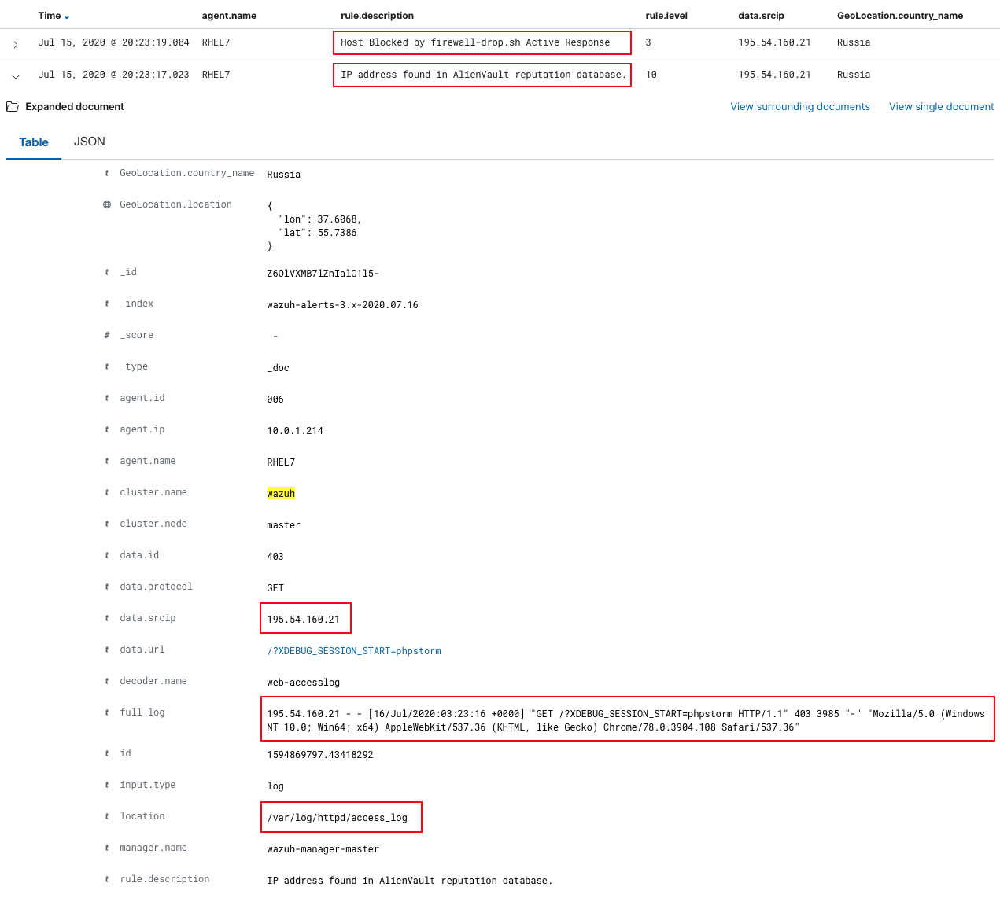
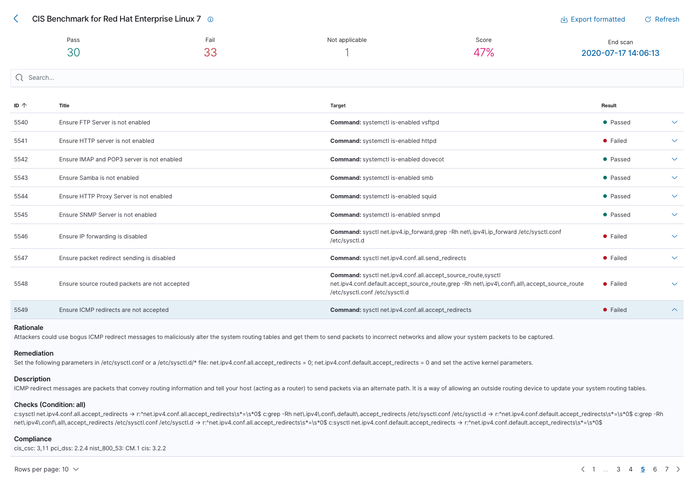
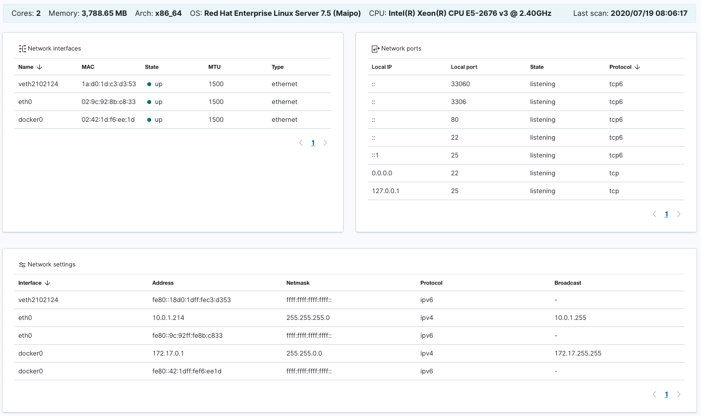
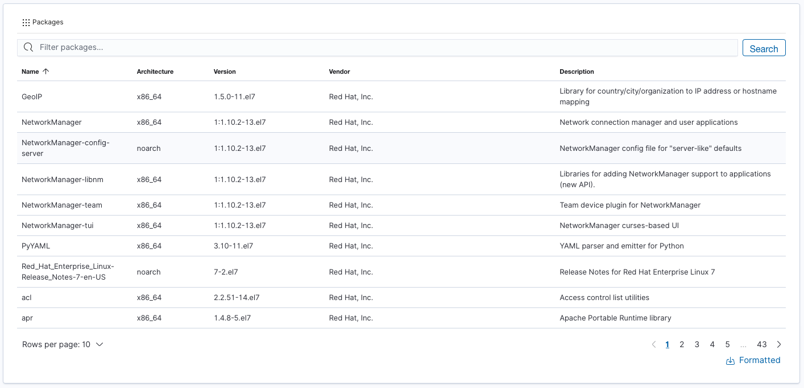
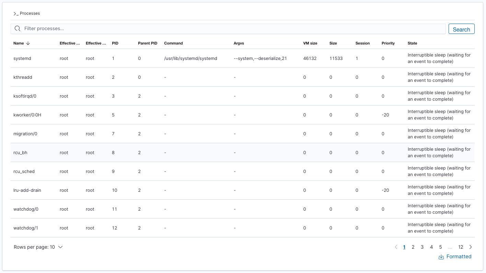
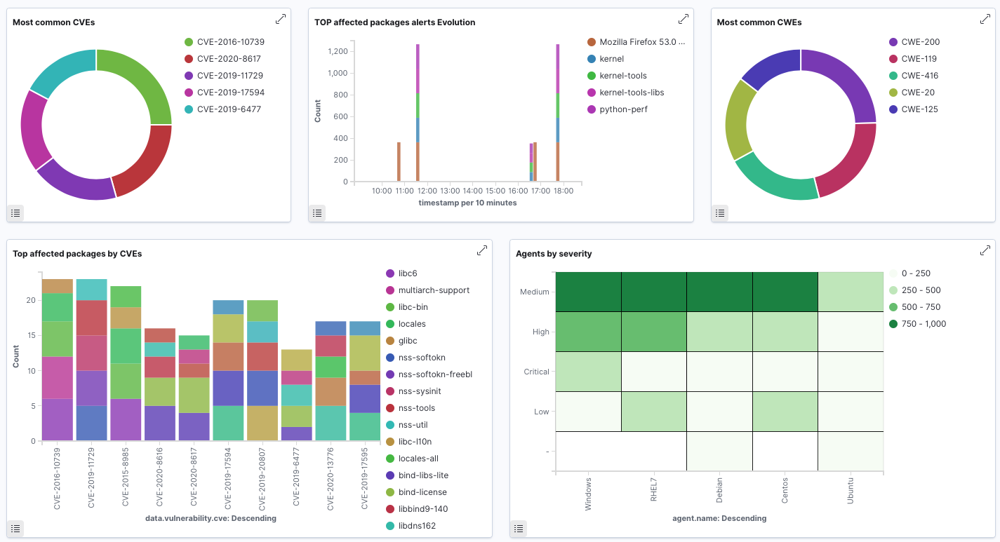

# 用例

Wazuh平台用于以不同方式保护和监视系统。由于其所有功能，它通常用于威胁预防，检测和响应。此外，Wazuh平台用于满足法规遵从性要求（例如PCI DSS或HIPAA）和配置标准（CIS加固指南）。 Wazuh是IaaS用户（例如Amazon AWS，Azure或Google云）中一种流行的安全解决方案，用于监视虚拟机和云实例。这是在系统级别利用Wazuh安全代理完成的，而在基础架构级别则是直接从云提供商的API中提取数据。 此外，Wazuh通常用于保护提供云原生运行时安全性的容器化环境。此功能基于与Docker引擎API和Kubernetes API的集成。此外，为了获得更好的保护，Wazuh安全代理可以在Docker主机上运行，​​从而提供了完整的威胁检测和响应功能。 在文档的此部分中，您将找到Wazuh解决方案的一些更常见用例的简短示例。

| 用例列表                                                     | 用例列表                                               |
| -------------------------------------------------------- | -------------------------------------------------- |
| 1.[Log data analysis](#日志数据分析log-data-analysis)          | 2.[File integrity monitoring](#file-integrity)     |
| 3.[Rootkits detection](#rootkits-detection)              | 4.[Active response](#active-response)              |
| 5.[Configuration assessment](#configuration-assessment)  | 6.[System inventory](#system-inventory)            |
| 7.[Vulnerability detection](#vulnerability-detection)    | 8.[Cloud security monitoring](#cloud-security)     |
| 9.[Containers security monitoring](#containers-security) | 10.[Regulatory compliance](#regulatory-compliance) |

## 日志数据分析(Log data analysis)

自动化的日志管理和分析可加速威胁检测。在许多情况下，可以在设备，系统和应用程序的日志消息中找到攻击的证据。 Wazuh可用于自动聚合和分析日志数据。 运行在受监视端点上的Wazuh代理通常负责读取操作系统和应用程序日志消息，并将其转发到进行分析的Wazuh服务器。如果未部署代理，则服务器还可以通过syslog从网络设备或应用程序接收数据。 Wazuh使用解码器来识别日志消息的源应用程序。然后，它使用特定于应用程序的规则分析数据。这是用于检测SSH身份验证失败事件的规则的示例：

```xml
<rule id="5716" level="5">
  <if_sid>5700</if_sid>
  <match>^Failed|^error: PAM: Authentication</match>
  <description>SSHD authentication failed.</description>
  <mitre>
    <id>T1110</id>
  </mitre>
  <group>authentication_failed,pci_dss_10.2.4,pci_dss_10.2.5,gpg13_7.1,gdpr_IV_35.7.d,gdpr_IV_32.2,hipaa_164.312.b,nist_800_53_AU.14,nist_800_53_AC.7,tsc_CC6.1,tsc_CC6.8,tsc_CC7.2,tsc_CC7.3,</group>
</rule>
```

规则包括一个`match`字段，用于定义规则将要查找的模式。还有一个`level`字段，用于指定结果警报的优先级。此外，规则还利用Mitre ATT＆CK框架中的技术标识符以及映射到法规遵从性控制来丰富事件。 每当代理之一或通过syslog收集的事件与优先级高于预定义阈值（默认值为3）的规则匹配时，管理器都会生成警报。 这是在`/var/ossec/logs/alerts/alerts.json`中找到的示例（为简洁起见，某些字段已删除）：

```json
  "agent": {
      "id": "005",
      "ip": "10.0.1.175",
      "name": "Centos"
  },
  "predecoder": {
      "hostname": "ip-10-0-1-175",
      "program_name": "sshd",
      "timestamp": "Jul 12 15:32:41"
  },
  "decoder": {
      "name": "sshd",
      "parent": "sshd"
  },
  "full_log": "Jul 12 15:32:41 ip-10-0-1-175 sshd[21746]: Failed password for root from 61.177.172.13 port 61658 ssh2",
  "location": "/var/log/secure",
  "data": {
      "dstuser": "root",
      "srcip": "61.177.172.13",
      "srcport": "61658"
  },
  "rule": {
      "description": "sshd: authentication failed.",
      "id": "5716",
      "level": 5,
      "mitre": {
          "id": [
              "T1110"
          ],
          "tactic": [
              "Credential Access"
          ],
          "technique": [
              "Brute Force"
          ]
      },
  },
  "timestamp": "2020-07-12T15:32:41.756+0000"
}
```

Wazuh服务器一旦生成警报，便会将警报发送到Elastic Stack组件，在其中将其丰富的地理位置信息进行存储和索引。然后，可以使用Kibana搜索，分析和可视化数据。以下是界面中显示的警报：


Wazuh提供了一个默认规则集，该规则集会定期更新，其中包含针对不同系统和应用程序的3,000多个规则。此外，Wazuh允许创建自定义规则。在用户手册中查找更多信息。

[BACK TO TOP](#用例)

---

## 文件完整性监控(File integrity monitoring)

修改操作系统或应用程序文件时，文件完整性监视（FIM）组件会检测并发出警报。此功能通常用于检测对敏感数据的访问或更改。如果您的服务器符合PCI DSS，则要求11.5规定必须安装文件完整性监视解决方案才能成功通过审核。 以下是更改受监视文件时生成的警报的示例。元数据包括MD5，SHA1和SHA256校验和，文件大小（更改前后），文件许可权，文件所有者，内容更改以及进行这些更改的用户（谁的数据）。

```json
{
  "agent": {
      "id": "006",
      "ip": "10.0.1.214",
      "name": "RHEL7"
  },
  "decoder": {
      "name": "syscheck_integrity_changed"
  },
  "syscheck": {
      "audit": {
          "effective_user": {
              "id": "0",
              "name": "root"
          },
          "group": {
              "id": "0",
              "name": "root"
          },
          "login_user": {
              "id": "1001",
              "name": "wazuh"
          },
          "process": {
              "cwd": "/home/wazuh",
              "id": "13235",
              "name": "/usr/bin/vim",
              "parent_cwd": "/home/wazuh",
              "parent_name": "/usr/bin/bash",
              "ppid": "10942"
          },
          "user": {
              "id": "0",
              "name": "root"
          }
      },
      "diff": "0a1\n> 8.8.8.8     ads.fastclick.net\n",
      "event": "modified",
      "gid_after": "0",
      "gname_after": "root",
      "inode_after": 198194,
      "inode_before": 55652,
      "md5_after": "feb5cea0deb5925101b642bca97dc7b3",
      "md5_before": "54fb6627dbaa37721048e4549db3224d",
      "mode": "whodata",
      "mtime_after": "2020-07-12T18:07:57",
      "mtime_before": "2020-07-12T18:00:55",
      "path": "/etc/hosts",
      "perm_after": "rw-r--r--",
      "sha1_after": "2aa2079c3972b4bb8f28d69877a7c5e93dacbe6f",
      "sha1_before": "7335999eb54c15c67566186bdfc46f64e0d5a1aa",
      "sha256_after": "48f09f8c313b303ce2ca9365f70ae8d992c5589c56493ac055f0ab129d82c365",
      "sha256_before": "498f494232085ec83303a2bc6f04bea840c2b210fbbeda31a46a6e5674d4fc0e",
      "size_after": "188",
      "size_before": "158",
      "uid_after": "0",
      "uname_after": "root"
  },
  "rule": {
      "description": "Integrity checksum changed.",
      "id": "550",
      "level": 7,
      "mitre": {
          "id": [
              "T1492"
          ],
          "tactic": [
              "Impact"
          ],
          "technique": [
              "Stored Data Manipulation"
          ]
      }
  },
  "timestamp": "2020-07-12T18:07:57.676+0000"
}
```

在FIM仪表板中可以找到文件更改的完整摘要，该仪表板提供了向下追溯功能，可以查看触发的警报的所有详细信息。



---

## rootkit检测(Rootkits detection)

Wazuh代理会定期扫描受监视的系统，以检测内核和用户空间级别的rootkit。这种恶意软件通常会替换或更改现有操作系统的组件，以更改系统行为。 Rootkit可以隐藏其他进程，文件和网络连接。 Wazuh使用不同的检测机制来搜索系统异常或众所周知的入侵。 Rootcheck组件定期执行此操作：

| Action                        | Detection mechanism                                 | Binary  | System call |
| ----------------------------- | --------------------------------------------------- | ------- | ----------- |
| Detection of hidden processes | Comparing output of systembinaries and system calls | ps      | setsid      |
| -                             | -                                                   | -       | getpgid     |
| -                             | -                                                   | -       | kill        |
| Detection of hidden files     | Comparing output of systembinaries and system calls | ls      | stat        |
| -                             | -                                                   | -       | opendir     |
| -                             | -                                                   | -       | readdir     |
| -                             | Scanning /dev                                       | ls      | opendir     |
| Detection of hidden ports     | Comparing output of systembinaries and system calls | netstat | bind        |
| Detection of known rootkits   | Using a malicious file database                     | -       | stat        |
| -                             | -                                                   | -       | fopen       |
| -                             | -                                                   | -       | opendir     |
| -                             | Inspecting files content usingsignatures            | -       | fopen       |
| -                             | Detecting file permission andownership anomalies    | -       | stat        |

以下是发现隐藏进程时生成警报的示例。在这种情况下，受影响的系统正在运行Linux内核级rootkit（名为Diamorphine）：

```json
{
  "agent": {
      "id": "1030",
      "ip": "10.0.0.59",
      "name": "diamorphine-POC"
  },
  "decoder": {
      "name": "rootcheck"
  },
  "full_log": "Process '562' hidden from /proc. Possible kernel level rootkit.",
  "rule": {
      "description": "Host-based anomaly detection event (rootcheck).",
      "id": "510",
      "level": 7
  },
  "timestamp": "2020-07-12T18:07:00-0800"
}
```

[BACK TO TOP](#%E7%94%A8%E4%BE%8B)

----

## 主动响应(Active response)

Wazuh代理通过在检测到威胁时运行操作来自动对威胁做出响应。<mark>Agent 具有阻止网络连接，停止运行进程或删除恶意文件等功能</mark>。此外，它还可以运行由用户开发的自定义脚本（例如，Python，Bash或PowerShell）。 为了使用此功能，用户定义了将触发脚本操作的条件，这些条件通常涉及威胁检测和评估。例如，用户可以使用日志分析规则来检测入侵尝试，并使用IP信誉数据库通过查找尝试的连接的源IP地址来评估威胁。 在上述情况下，当源IP地址被识别为恶意（信誉低下）时，通过自动设置防火墙规则以丢弃来自攻击者的所有流量，可以保护受监视系统。根据活动响应，此防火墙规则是临时的或永久的。 在下面，您可以找到用于定义两个用于自动连接阻止的脚本的配置。在Linux系统上，Wazuh代理通常为此目的与本地Iptables防火墙集成。相反，在Windows系统上，它使用空路由技术（也称为blackholing）：

```xml
<command>
  <name>firewall-drop</name>
  <executable>firewall-drop.sh</executable>
  <expect>srcip</expect>
  <timeout_allowed>yes</timeout_allowed>
</command>
```

```xml
<command>
  <name>win_route-null</name>
  <executable>route-null.cmd</executable>
  <expect>srcip</expect>
  <timeout_allowed>yes</timeout_allowed>
</command>
```

在定义的命令之上，活动响应设置触发它们所需的条件。下面是一个示例，该示例将在日志分析规则`100100`匹配时触发firewall-drop命令。

```xml
<active-response>
  <command>firewall-drop</command>
  <location>local</location>
  <rules_id>100100</rules_id>
  <timeout>60</timeout>
</active-response>
In this case, rule 100100 is used to look for alerts where the source IP address is part of a well-known IP reputation database:
```

```xml
<rule id="100100" level="10">
  <if_group>web|attack|attacks</if_group>
  <list field="srcip" lookup="address_match_key">etc/lists/blacklist-alienvault</list>
  <description>IP address found in AlienVault reputation database.</description>
</rule>
```

以下是带有两个Wazuh警报的屏幕截图：一个是在检测到Web攻击（试图利用PHP服务器漏洞）时触发的，另一个是通知恶意行为者已被阻止的触发。



[BACK TO TOP](#%E7%94%A8%E4%BE%8B)

---

## 配置评估(Configuration assessment)

自动化安全配置评估（SCA）是改善企业安全状况并减少攻击面的一项基本功能。 Wazuh SCA模块有助于通过受监视的端点维护标准配置。这是通过基于Internet安全中心（CIS）强化指南的预定义检查来完成的。 启用S​​CA模块后，Wazuh代理会定期执行扫描，并报告受监视系统中的错误配置。这些扫描通过策略文件评估系统的配置，其中包含一组要运行的检查。例如，SCA检查可以检查文件系统配置，查找是否存在软件更新或安全补丁，查看是否启用了本地防火墙，识别不必要的运行服务或验证用户的密码策略。 SCA扫描策略以YAML格式编写，使用户可以快速了解它们。使用SCA语法，用户可以扩展现有策略以满足他们的需求或编写新策略。每个策略包含一组检查，并且每个检查都有一个或多个规则。例如，规则可用于查找文件，目录，Windows注册表项或正在运行的进程等的存在。也可以执行命令并根据正则表达式检查其输出。 Linux SCA规则示例：

```yaml
- id: 5546
  title: "Ensure IP forwarding is disabled"
  description: "The net.ipv4.ip_forward flag is used to tell the system whether it can forward packets or not."
  rationale: "Setting the flag to 0 ensures that a system with multiple interfaces (for example, a hard proxy), will never be able to forward packets, and therefore, never serve as a router."
  remediation: "Set the following parameter in /etc/sysctl.conf or a /etc/sysctl.d/* file: net.ipv4.ip_forward = 0 and set the active kernel parameters."
  compliance:
    - cis: ["3.1.1"]
    - cis_csc: ["3", "11"]
    - pci_dss: ["2.2.4"]
    - nist_800_53: ["CM.1"]
  condition: all
  rules:
    - 'c:sysctl net.ipv4.ip_forward -> r:^net.ipv4.ip_forward\s*=\s*0$'
    - 'c:grep -Rh net\.ipv4\.ip_forward /etc/sysctl.conf /etc/sysctl.d -> r:^net.ipv4.ip_forward\s*=\s*0$'
```

Windows SCA规则示例：

```yaml
- id: 14038
  title: "Ensure Microsoft Firewall is enabled"
  compliance:
    - pci_dss: ["10.6.1", "1.4"]
    - hipaa: ["164.312.b", "164.312.a.1"]
    - nist_800_53: ["AU.6", "SC.7"]
    - tsc: ["CC6.1", "CC6.8", "CC7.2", "CC7.3", "CC6.7"]
  condition: all
  rules:
    - 'r:HKEY_LOCAL_MACHINE\software\policies\microsoft\windowsfirewall\domainprofile -> enablefirewall -> 1'
```

macOS SCA规则示例：

```yaml
- id: 8522
  title: "Ensure nfs server is not running"
  description: "macOS can act as an NFS fileserver. NFS sharing could be enabled to allow someone on another computer to mount shares and gain access to information from the user's computer. File sharing from a user endpoint has long been considered questionable and Apple has removed that capability from the GUI. NFSD is still part of the Operating System and can be easily turned on to export shares and provide remote connectivity to an end user computer."
  rationale: "File serving should not be done from a user desktop, dedicated servers should be used.  Open ports make it easier to exploit the computer."
  remediation: "Ensure that the NFS Server is not running and is not set to start at boot Stop the NFS Server: sudo nfsd disable    Remove the exported Directory listing: rm /etc/export"
  compliance:
    - cis: ["4.5"]
  condition: none
  rules:
    - 'p:nfsd'
    - 'p:/sbin/nfsd'
    - 'f:/etc/exports'
```

以下是配置评估评估结果的示例。这些可以通过Web用户界面或直接通过Wazuh RESTful API获得。



[BACK TO TOP](#%E7%94%A8%E4%BE%8B)

---

## 系统盘点(System inventory)

Wazuh代理系统清单模块从受监视的系统收集硬件和软件信息。此功能有助于识别资产并评估补丁程序管理的有效性。 可以通过Wazuh RESTful API和Web用户界面查询每个受监视端点收集的清单数据。这包括内存使用情况，磁盘空间，CPU规格，网络接口，打开的端口，正在运行的进程以及已安装的应用程序列表。 为了收集数据，Wazuh代理运行定期扫描（时间间隔是可配置的）。扫描完成后，代理会将新库存数据与以前扫描中的旧库存数据进行比较。这样，代理可以识别系统事件，例如，当打开新端口，已停止进程或已安装新应用程序时。 硬件清单，网络接口，开放端口和网络设置的示例：



软件清单示例：



运行进程清单示例：



[BACK TO TOP](#%E7%94%A8%E4%BE%8B)

---

## 漏洞检测(Vulnerability detection)

攻击者通常会将易受攻击的软件应用程序作为攻击目标，以破坏端点并在目标网络上获得持久存在。 Wazuh平台依靠其软件清单功能，维护安装了Wazuh代理的端点上安装的所有应用程序的最新列表。通过将此信息与国家漏洞数据库（NVD）以及从不同操作系统供应商收集的信息进行关联，Wazuh能够识别易受攻击的应用程序并生成风险报告。 为了检测易受攻击的软件，Wazuh使用通过使用从以下来源提取的数据自动创建的常见漏洞和暴露（CVE）数据库：

- [CVEs for Ubuntu Linux distributions](https://canonical.com/)

- [CVEs for Red Hat and CentOS Linux distributions](https://access.redhat.com/)

- [CVEs for Debian Linux distributions](https://www.debian.org/)

- [CVEs from the National Vulnerability Database](https://nvd.nist.gov/)

- [Microsoft Security Response Center](https://www.microsoft.com/msrc)

为了启用漏洞检测，用户需要配置Wazuh代理以收集软件清单数据，并配置Wazuh服务器从不同的漏洞源中提取CVE信息。这是漏洞检测警报的示例：

```json
{
  "agent": {
    "id": "003",
    "ip": "10.0.1.102",
    "name": "Windows"
  },
  "location": "vulnerability-detector",
  "data": {
    "vulnerability": {
      "assigner": "cve@mitre.org",
      "cve": "CVE-2020-12395",
      "cve_version": "4.0",
      "cvss": {
        "cvss2": {
          "base_score": "10",
          "vector": {
            "access_complexity": "low",
            "attack_vector": "network",
            "authentication": "none",
            "availability": "complete",
            "confidentiality_impact": "complete",
            "integrity_impact": "complete"
          }
        }
      },
      "cwe_reference": "CWE-119",
      "package": {
        "architecture": "x86_64",
        "condition": "less than 68.8.0",
        "generated_cpe": "a:mozilla:thunderbird:68.0::::::x86_64:",
        "name": "Mozilla Thunderbird 68.0 (x64 en-US)",
        "version": "68.0"
      },
      "published": "2020-05-26",
      "references": [
        "https://bugzilla.mozilla.org/buglist.cgi?bug_id=1595886%2C1611482%2C1614704%2C1624098%2C1625749%2C1626382%2C1628076%2C1631508",
        "https://security.gentoo.org/glsa/202005-03",
        "https://security.gentoo.org/glsa/202005-04",
        "https://usn.ubuntu.com/4373-1/",
        "https://www.mozilla.org/security/advisories/mfsa2020-16/",
        "https://www.mozilla.org/security/advisories/mfsa2020-17/",
        "https://www.mozilla.org/security/advisories/mfsa2020-18/",
        "https://nvd.nist.gov/vuln/detail/CVE-2020-12395"
      ],
      "severity": "High",
      "title": "Mozilla developers and community members reported memory safety bugs present in Firefox 75 and Firefox ESR 68.7. Some of these bugs showed evidence of memory corruption and we presume that with enough effort some of these could have been exploited to run arbitrary code. This vulnerability affects Firefox ESR < 68.8, Firefox < 76, and Thunderbird < 68.8.0.",
      "updated": "2020-06-12"
    }
  },
  "rule": {
    "description": "CVE-2020-12395 affects Mozilla Thunderbird 68.0 (x64 en-US)",
    "id": "23505",
    "level": 10
  },
  "timestamp": "2020-07-20T00:41:36.302+0000"
}
```

漏洞检测仪表板：



[BACK TO TOP](#%E7%94%A8%E4%BE%8B)

---

## 云安全监控(Cloud security monitoring)


[BACK TO TOP](#%E7%94%A8%E4%BE%8B)

---

## 容器安全监控(Containers security monitoring)


[BACK TO TOP](#%E7%94%A8%E4%BE%8B)

---

## 监管合规(Regulatory compliance)

合规性 Wazuh平台通常用于满足法规遵从标准的技术方面。 Wazuh不仅提供必要的安全控制（例如入侵检测，配置评估，日志分析，漏洞检测等）来满足合规性要求，而且还使用其SIEM功能集中，分析和丰富安全数据。 为了提供合规性支持，已将Wazuh规则与合规性要求进行了仔细映射。这样，当生成警报（匹配规则条件）时，它会自动包括合规性信息。这是当前支持的标准的列表： 支付卡行业数据安全标准（PCI DSS） 通用数据保护条例（GDPR） NIST特殊出版物800-53（NIST 800-53） 良好做法指南13（GPG13） 信托服务标准（TSC SOC2） 健康保险可移植性和责任法（HIPAA） 此外，Wazuh规则包括使用MITER ATT＆CK框架进行映射，该框架用于警报分类并提供更好的安全上下文。以下是用于检测对Apache Web服务器中禁止目录的访问的检测规则示例：