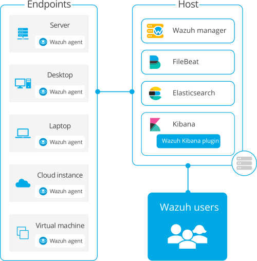
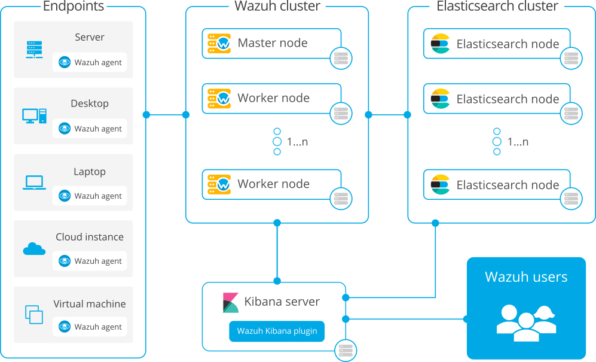

# Wazuh server 安装

本部分为用户提供了必要的信息，以使用Open Distro for Elasticsearch 进行 Wazuh 的安装，Elasticsearch 是Apache 2.0 许可的发行版，通过 Elastic Security 提供了企业安全性，警报，SQL支持，自动索引管理或深度性能分析等增强功能。其他特性。

## 部署类型

根据选择的配置，安装指南分为两个独立的部分：多合一部署和分布式部署。 

- **多合一部署**：Wazuh 和Open Distro for Elasticsearch 安装在同一主机上。这种类型的部署适用于测试和小型工作环境。 

- **分布式部署**：每个组件都作为单节点或多节点群集安装在单独的主机中。这种类型的部署允许产品的高可用性和可伸缩性，并且在大型工作环境中很方便。

## 安装方式

对于每种部署类型，用户可以在两种安装方法之间进行选择： 

- **无人值守**：自动安装。它需要初始输入必要的信息才能通过脚本执行安装过程。

- **逐步安装**：手动安装。包括安装过程中每个步骤的详细说明。

----

## 多合一部署

本节指导在同一主机上安装和配置 Wazuh Server 和 Elastic Stack。这种类型的部署适用于测试和小型生产环境。



将安装以下组件： 

- Wazuh Server，包括作为单节点群集的 **Wazuh Manager** 和 **Wazuh API**。

- Elastic Stack，包括作为单节点群集的OpenDistro for Elasticsearch，Filebeat和Kibana，包括Wazuh Kibana插件。 

通信将使用SSL证书进行加密。这些证书将使用Search Guard脱机TLS工具生成。 另外，为了正确使用Wazuh Kibana插件，将添加额外的Elasticsearch角色和用户。

----

### 无人值守安装

文档的此部分说明如何使用脚本自动在单个主机上安装Wazuh，该脚本将自动检测操作系统是否使用rpm或deb软件包。该脚本将执行运行状况检查，以验证可用的系统资源是否满足最低要求。有关更多信息，请访问需求部分。 该脚本将安装Java Development Kit和其他软件包，包括Open Distro for Elasticsearch所需的unzip和libcap。此外，Search Guard离线TLS工具将用于生成证书，以保护Elastic Stack中的数据。

#### 安装 Wazuh

<mark>以下所有使用的命令都需要 root 权限</mark>。

##### 1.下载运行安装脚本

```bash
# 下载脚本
curl -so all-in-one-installation.sh https://raw.githubusercontent.com/wazuh/wazuh-documentation/4.0/resources/open-distro/unattended-installation/all-in-one-installation.sh
# 运行安装
bash all-in-one-installation.sh
```

该脚本将执行运行状况检查，以确保主机具有足够的资源来保证适当的性能。要跳过此步骤，请在运行脚本时添加 `-i` 或 `--i​​gnore-healthcheck` 选项。 执行脚本后，它将显示以下消息，以确认安装成功：

```bash
Installing all necessary utilities for the installation...
Done
Adding the Wazuh repository...
Done
Installing the Wazuh manager...
Done
Wazuh-manager started
Installing Open Distro for Elasticsearch...
Done
Configuring Elasticsearch...
Certificates created
Elasticsearch started
Initializing Elasticsearch...
Done
Installing Filebeat...
Filebeat started
Done
Installing Open Distro for Kibana...
Kibana started
Done
Checking the installation...
Elasticsearch installation succeeded.
Filebeat installation succeeded.
Initializing Kibana (this may take a while)
########
Installation finished
```

##### 2.访问Web界面

```bash
URL: https://<wazuh_server_ip>
user: admin
password: admin
```

首次访问Kibana时，浏览器显示警告消息，指示证书不是由受信任的机构颁发的。可以在浏览器的高级选项中添加例外，或者为了提高安全性，可以将以前生成的`root-ca.pem`文件导入浏览器的证书管理器中。或者，可以配置来自可信机构的证书。

###### 定制安装

在`/etc/kibana/kibana.yml`文件中找到的Kibana配置将server.host参数设置为0.0.0.0。这意味着可以从外部访问Kibana，并将接受主机的所有可用IP。如果需要，可以为特定IP更改此值。 强烈建议为`/usr/share/elasticsearch/plugins/opendistro_security/securityconfig/internal_users.yml`文件中找到的用户更改Elasticsearch的默认密码。有关此过程的更多信息，请参见此处。 Kibana运行之后，有必要为每个用户分配相应的角色。要了解更多信息，请访问“设置Wazuh Kibana插件”部分。 要在一次安装中卸载全部组件的所有组件，请访问卸载部分。


### 逐步安装

本文档指导在多合一部署中安装Wazuh和Open Distro for Elasticsearch组件。这种类型的部署适用于测试和小型工作环境。 本指南提供了有关配置官方存储库以执行安装的说明。或者，也可以使用软件包来完成安装。在我们的软件包列表中查看可用软件包的列表。

#### 先决条件

适用于Elasticsearch的Open Distro需要Java开发套件以及其他软件包的安装，例如wget，curl，unzip和libcap，这些软件包将在后续步骤中使用.

安装所有必需的软件包以进行安装：

```bash
export JAVA_HOME=/usr/ && yum install curl unzip wget libcap && yum install java-11-openjdk-devel
```

如果JDK 11对于所使用的操作系统不可用，请使用“采用Open JDK”安装软件包“ openingopenjdk-11-hotspot”。

#### 安装Wazuh

Wazuh服务器从已部署的Wazuh代理收集并分析数据。它运行Wazuh管理器，Wazuh API和Filebeat。 设置Wazuh的第一步是将Wazuh存储库添加到服务器。

##### 添加Wazuh repository

```bash
# 导入GPG密钥
rpm --import https://packages.wazuh.com/key/GPG-KEY-WAZUH


# 添加 repository
cat > /etc/yum.repos.d/wazuh.repo << EOF
[wazuh]
gpgcheck=1
gpgkey=https://packages.wazuh.com/key/GPG-KEY-WAZUH
enabled=1
name=EL-$releasever - Wazuh
baseurl=https://packages.wazuh.com/4.x/yum/
protect=1
EOF
```

##### 安装 Wazuh manager

```bash
# 安装 wazuh-manager 软件包
yum install wazuh-manager

# 重新加载systemd Manager配置
systemctl daemon-reload
# 配置开机启动
systemctl enable wazuh-manager
# 启动开机启动
systemctl start wazuh-manager

# 查看 是否正确安装
systemctl status wazuh-manager
```

##### 安装 Elasticsearch

```bash
yum install opendistroforelasticsearch

# 下载 ES 配置文件
curl -so /etc/elasticsearch/elasticsearch.yml https://raw.githubusercontent.com/wazuh/wazuh-documentation/4.0/resources/open-distro/elasticsearch/7.x/elasticsearch_all_in_one.yml

# 为了正确使用Wazuh Kibana插件，要添加额外的角色和用户
curl -so /usr/share/elasticsearch/plugins/opendistro_security/securityconfig/roles.yml https://raw.githubusercontent.com/wazuh/wazuh-documentation/4.0/resources/open-distro/elasticsearch/roles/roles.yml
curl -so /usr/share/elasticsearch/plugins/opendistro_security/securityconfig/roles_mapping.yml https://raw.githubusercontent.com/wazuh/wazuh-documentation/4.0/resources/open-distro/elasticsearch/roles/roles_mapping.yml
curl -so /usr/share/elasticsearch/plugins/opendistro_security/securityconfig/internal_users.yml https://raw.githubusercontent.com/wazuh/wazuh-documentation/4.0/resources/open-distro/elasticsearch/roles/internal_users.yml
```

TBD


---

## 分布式部署

本节指导 Wazuh Server 和 Elastic Stack 的分布式安装和配置。在这种类型的部署中，组件将安装在单独的主机上。 Kibana可以安装在Elasticsearch节点的同一服务器上，也可以安装在单独的服务器上。这种部署类型适用于生产环境，因为它提供了高可用性和服务可伸缩性。



将安装以下组件：

- Wazuh Server，包括作为单节点群集或多节点群集的Wazuh管理器，Wazuh API和Filebeat。 

- Elastic Stack，包括Open Distro for Elasticsearch（作为单节点群集或多节点群集），以及Kibana（包括Wazuh Kibana插件），与Elasticsearch节点位于同一主机上或位于单独的主机上。
  
  通信将使用SSL证书进行加密。这些证书将使用Search Guard脱机TLS工具生成。 另外，为了正确使用Wazuh Kibana插件，将添加额外的Elasticsearch角色和用户。

---

### 无人值守安装

无人参与的安装方法由两个脚本组成，这两个脚本将自动安装Wazuh集群和Elasticsearch集群所涉及的所有组件。

将安装以下组件： 

- Elasticsearch集群：该脚本将安装Open Distro for Elasticsearch。可以在单节点安装或多节点安装之间选择。另外，给出的脚本可以在同一Elasticsearch节点上或在不同的节点上安装Open Distro for Kibana。 Open Distro for Kibana的安装还包括Wazuh Kibana插件的安装。 

- Wazuh集群：该脚本将安装Wazuh管理器和Filebeat。 

<mark>强烈建议先安装Open Distro for Elasticsearch</mark>，因为保护通信所需的证书是在安装过程中创建的。

#### Elasticsearch＆Kibana无人值守安装

<mark>以下所有使用的命令都需要 root 权限。</mark>

该脚本允许安装 Elasticsearch 和 Kibana。它们可以安装在一起，也可以安装在单独的计算机中。运行脚本的可用选项包括:

| Options                       | Purpose                                                                                                |
| ----------------------------- | ------------------------------------------------------------------------------------------------------ |
| -e<br> –install-elasticsearch | Installs Open Distro for Elasticsearch (不能与 `-k` 选项同时使用)                                               |
| -k<br>–install-kibana         | Installs Open Distro for Kibana (不能与 `-e` 选项同时使用)                                                      |
| -n<br>–node-name              | Indicates the name of the instance                                                                     |
| -c<br>–create-certificates    | Generates the certificates for all the nodes indicated on the configuration file (仅在 multi-node 模式下有效) |
| -d<br>–debug                  | 显示完整的安装日志                                                                                              |
| -i<br>–ignore-healthcheck     | 忽略健康检查(宿主机性能)                                                                                          |
| -h<br>–help                   | 显示帮助                                                                                                   |
