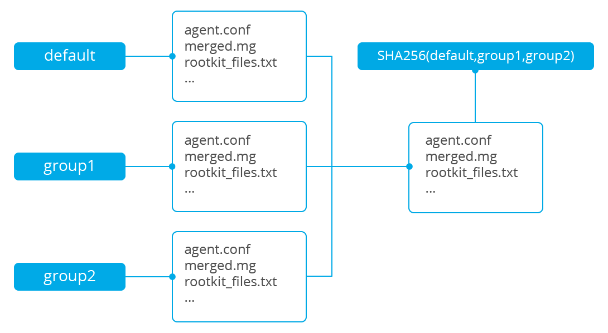

# Agent 分组

> 3.0.0版中的新功能。

有两种方法配置已注册的 `Agent`。
可以使用 [ossec.conf](https://documentation.wazuh.com/current/user-manual/reference/ossec-conf/index.html) 文件在本地对其进行配置，
也可以使用[集中式配置](https://documentation.wazuh.com/current/user-manual/reference/centralized-configuration.html)对其进行远程配置。
如果使用集中式配置，则可以将Agent分配给组，每个组具有唯一的配置。这大大简化了整个配置过程。

> Read the [Agent groups and centralized configuration](https://wazuh.com/blog/agent-groups-and-centralized-configuration/) document for more information.

除非另行分配，否则所有新连接的 Agent 将自动属于`default` 组。该组是在安装过程中创建的，
配置文件放置在`/var/ossec/etc/shared/default/`文件夹中。这些文件将从Manager推送到属于该组的所有Agent。

分配之前，必须先创建和配置该组。

## 为Agent分配一个组的步骤

添加Agent并将其连接到Manager后，请使用[agent_group](https://documentation.wazuh.com/current/user-manual/reference/tools/agent_groups.html)工具或Wazuh API将其分配给一个组。以下是如何使用上述方法将Agent ID 为 002 的Agent分配到一个名为 `dbms` 的组

使用 agent_ groups工具：

```bash
/var/ossec/bin/agent_groups -a -i 002 -g dbms
```

使用Wazuh API [PUT /agents/{agent_id}/group/{group_id}](https://documentation.wazuh.com/current/user-manual/api/reference.html#operation/api.controllers.agent_controller.put_agent_single_group)：

```bash
curl -k -X PUT "https://localhost:55000/agents/002/group/dbms?pretty=true" -H  "Authorization: Bearer $TOKEN"
```

输出结果:

```json
{
  "data": {
      "affected_items": ["002"],
      "total_affected_items": 1,
      "total_failed_items": 0,
      "failed_items": [],
  },
  "message": "All selected agents were assigned to dbms",
  "error": 0,
}
```

可以使用以下方式之一检查Agent的组分配：

使用**agent_ groups**：

```bash
/var/ossec/bin/agent_groups -l -g dbms
```

输出结果:

```bash
5 agent(s) in group 'dbms':
 ID: 002 Name: agent-dbms-e1.
 ID: 003 Name: agent-dbms-e2.
 ID: 004 Name: agent-dbms-a1.
 ID: 005 Name: agent-dbms-a2.
 ID: 006 Name: agent-dbms-a3.
```

使用**Wazuh API** [GET /groups/{group_id}/agents](https://documentation.wazuh.com/current/user-manual/api/reference.html#operation/api.controllers.agent_controller.get_agents_in_group)：

```bash
curl -k -X GET "https://localhost:55000/groups/dbms/agents?pretty=true&select=id,name" -H  "Authorization: Bearer $TOKEN"
```

输出结果:

```json
{
   "data": {

       "affected_items": [
           {"name": "agent-dbms-e1", "id": "002"},
           {"name": "agent-dbms-e2", "id": "003"},
           {"name": "agent-dbms-a1", "id": "004"},
           {"name": "agent-dbms-a2", "id": "005"},
           {"name": "agent-dbms-a3", "id": "006"},
       ],
       "total_affected_items": 5,
       "total_failed_items": 0,
       "failed_items": [],

   },
   "message": "All selected agents information was returned",
   "error": 0,
}
```

1. 一旦组被创建，它的`agent.conf`文件可以进行编辑，包括你想分配给该具体配置组。对于此示例，要编辑的文件位于，`/var/ossec/etc/shared/dbms/agent.conf`并且属于该组的每个Agent都将接收该文件。

2. 连接到Manager的20分钟内，分配给组的每个AgeManager从管理器接收*“ dbms”*文件夹中包含的`agent.conf`文件，包括在上一Manager改的文件。管理器将这些文件Agent到代理所花费的时间长短取决于文件Agent小，组中代理的数量以及所使用的连接协议。例如，取决于网络带宽和性能，使AgentDP在100个代理上接收10 MB文件夹（不包括**merged.mg**文件）可能需要8分钟，但是，如果使用TCP，则移动速度可能会更快。

3. 一旦特定的座席属于某个组，则即使该Agent以其他名称或ID注Agent该代理也将**自动重新分配**到该组。发生这种情况的原因是，在重新注册座席时，会将`merged.mg`座席发送的校验和与在Manager中注册的其他座席的校验和进行比较。然而，这是不是默认的行为，而且，如果需要的话，必须由用户明确激活`local_internal_options.conf`通过添加选项（参见在[内部选件](https://documentation.wazuh.com/current/user-manual/reference/internal-options.html)）。`remoted.guess_agent_group=1``remoted`[](https://documentation.wazuh.com/current/user-manual/reference/internal-options.html)

-----

## 多组小号

>  3.7.0版中的新功能。

从Wazuh v3.7.0开始，Agent具有属于多个组的Agent。代理将从每个组接收所有配置文件。从最后分配的组接收的配置具有比其他组更高的优先级。

### 管理多个组小号

- [将多个组分配给一个Agent](https://documentation.wazuh.com/current/user-manual/agents/grouping-agents.html?highlight=group#assigning-multiple-groups-to-an-agent)

- [清单组和配置](https://documentation.wazuh.com/current/user-manual/agents/grouping-agents.html?highlight=group#listing-groups-and-configuration)

- [多进行更改组小号](https://documentation.wazuh.com/current/user-manual/agents/grouping-agents.html?highlight=group#making-changes-on-multiple-groups)

- [共享文件的行为](https://documentation.wazuh.com/current/user-manual/agents/grouping-agents.html?highlight=group#shared-files-behavior)

此功能专注于以更高的粒度自定义Agent的配置。该**Wazuh API**和**agent_组小号** 帮助管理组通过列出他们还通过允许分配/变更/取消分Agent，代理商秒。让我们Agent下在现有代理上管理多个组的三个用例。

### 将多个组分配给一个Agent

将多个组设置为一个Agent很简单，可以通过三种不同的方式Agent个代理分配给一个或多个组：注册，CLI和API。

在此示例中，Agent001已添加到Web服务器和apache 组s。首先，使用**Wazuh API**端点[PUT / agents / {agent_id} / group / {group_id}](https://documentation.wazuh.com/current/user-manual/api/reference.html#operation/api.controllers.agent_controller.put_agent_single_group)：

curl -k -X PUT "https://localhost:55000/agents/001/group/webserver?pretty=true" -H  "Authorization: Bearer $TOKEN"

Output

{
    "data": {
        "affected_items": ["001"],
        "total_affected_items": 1,
        "total_failed_items": 0,
        "failed_items": [],
    },
    "message": "All selected agents were assigned to webserver",
    "error": 0,
}

curl -k -X PUT "https://localhost:55000/agents/001/group/apache?pretty=true" -H  "Authorization: Bearer $TOKEN"

Output

```xml
{
    "data": {
        "affected_items": ["001"],
        "total_affected_items": 1,
        "total_failed_items": 0,
        "failed_items": [],
    },
    "message": "All selected agents were assigned to apache",
    "error": 0,
}
```

之后，我们可以使用**Wazuh API**端点[GET / agents](https://documentation.wazuh.com/current/user-manual/api/reference.html#operation/api.controllers.agent_controller.get_agents)来询问组s属于**哪个**[Agent](https://documentation.wazuh.com/current/user-manual/api/reference.html#operation/api.controllers.agent_controller.get_agents)：

curl -k -X GET "https://localhost:55000/agents?pretty=true&agents_list=001&select=group" -H  "Authorization: Bearer $TOKEN"

Output

```json
{
    "data": {
        "affected_items": [{"group": ["default", "webserver", "apache"], "id": "001"}],
        "total_affected_items": 1,
        "total_failed_items": 0,
        "failed_items": [],
    },
    "message": "All selected agents information was returned",
    "error": 0,
}
```

在这种情况下，当任何配置参数存在冲突时，组 apache的远程配置是三个组中的最高优先级。

使用**agent_ group的**CLI，可以以相同的方式将Agent注册到group：

$ /var/ossec/bin/agent_groups -a -i 001 -g webserver

Output

Do you want to add the group 'webserver' to the agent '001'? [y/N]: y
Group 'webserver' added to agent '001'.

$ /var/ossec/bin/agent_groups -a -i 001 -g apache

Output

Do you want to add the group 'apache' to the agent '001'? [y/N]: y
Group 'apache' added to agent '001'.

要在注册过程中将Agent分配给一个或多个组，请使用-G选Agent册代理以设置Agent其中包含代理的组：

>  /var/ossec/bin/agent-auth -m MANAGER_IP -G webserver,apache

### 清单组和配置

可以实时了解属于组的Agent，以及根据其所属的组来应用于每个组的配置和共享文件。

例如，要列出当前可用的组，我们可以对**agent_groups**运行以下查询：

/var/ossec/bin/agent_groups -l -g webserver

Output

3 agent(s) in group 'webserver':
  ID: 001 Name: ag-windows-12.
  ID: 003 Name: ag-windows-east.
  ID: 004 Name: centos-7-apache

同样容易查询将哪些组分配给Agent001：

/var/ossec/bin/agent_groups -s -i 001

Output

The agent 'ag-windows-12' with ID '001' has the group: '[u'webserver', u'apache']'.

组s的优先级从左到右增加，最后一个是最高优先级。

### 多进行更改组小号

可以为Agent分配多个组的方法相同，也可以还原分配并在可用组之间进行切换。下面显示了Agent为代理001设置组apache：

/var/ossec/bin/agent_groups -r -i 001 -g apache -q

Output

Group 'apache' unset for agent '001'.

/var/ossec/bin/agent_groups -s -i 001

Output

The agent 'ag-windows-12' with ID '001' has the group: '[u'webserver']'.

也可以在组s之间进行切换，以覆盖现有分配：

/var/ossec/bin/agent_groups -s -i 001

Output

The agent 'ag-windows-12' with ID '001' has the group: '[u'default', u'webserver']'.

/var/ossec/bin/agent_groups -a -f -i 001 -g apache

Output

Group 'apache' set to agent '001'.

/var/ossec/bin/agent_groups -s -i 001

Output

The agent 'ag-windows-12' with ID '001' has the group: '[u'apache']'.

该`-f`参数重置分配给Agent的组s并强制其仅属于新组。

最后，要检查的同步状态组配置为单一药剂，无论是以下方法是可用的，**agent_组小号**和**Wazuh API**端点[GET /剂/ {AGENT_ID} /组/ is_sync](https://documentation.wazuh.com/current/user-manual/api/reference.html#operation/api.controllers.agent_controller.get_sync_agent)：

 /var/ossec/bin/agent_groups -S -i 001

Output

The agent '001' sync status is: Agent configuration is synced.

 curl -k -X GET "https://localhost:55000/agents/001/group/is_sync?pretty=true" -H  "Authorization: Bearer $TOKEN"

Output

```json
{
    "error": 0,
    "data": {
        "affected_items": [
            {
                "id": "001",
                "synced": true
            }
        ],
        "total_affected_items": 1,
        "total_failed_items": 0,
        "failed_items": []
    },
    "message": "Sync info was returned for all selected agents"
}
```

的能力的其余**agent_组小号**可以在其中找到[的参考部分](https://documentation.wazuh.com/current/user-manual/reference/tools/agent_groups.html)。[Wazuh API](https://documentation.wazuh.com/current/user-manual/api/reference.html)相同，它提供具有类似行为的调用。

### 共享文件的行为

如上所述，传统上，Manager根据其Agent所属的Agent其代理共享配置文件。

如果属于多个组，则每个组的配置文件将按照以下条件合并为一个：

- 共享文件中加入了共享文件（例如用于rootkit检测的CIS基准），如果共享文件重复，则最后添加的文件将覆盖旧文件。

- `agent.conf`添加的新文件将追加到现有文件中。当两个组的配置冲突时，分配给Agent的最后一个组将是前一个。在《[集中式配置手册》中](https://documentation.wazuh.com/current/user-manual/reference/centralized-configuration.html)了解有关配置优先级的更多信息。

- 从用户设置到特定组的自定义共享文件也将加入以将其发送给Agent。


