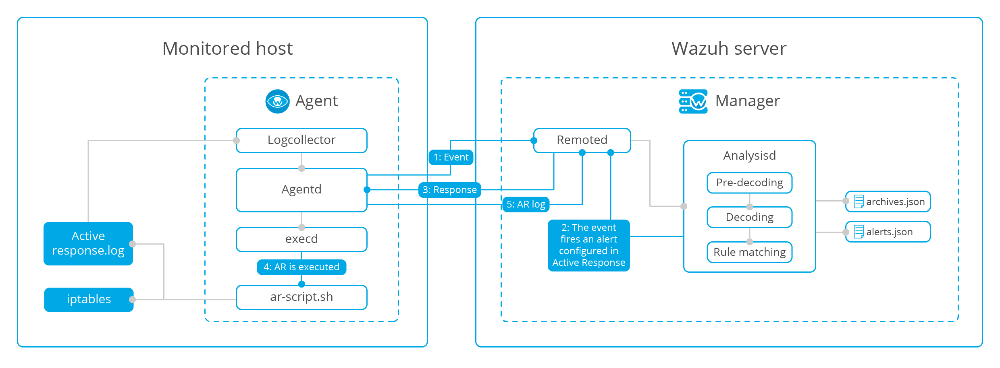

# 主动响应(Active Response)

主动响应会执行各种对策来应对主动威胁，例如在满足某些条件时阻止从威胁源访问 `Agent`。

当触发特定的警报(基于警报级别或者规则组)时, 主动响应会执行一个(或任意个)脚本来响应对应的警报。
但是，应仔细考虑这些响应。规则和响应脚本实现不当,可能会增加系统的脆弱性。

主动响应的日志在 `/var/ossec/logs/active-responses.log` 。

## 目录

======================================

- [主动响应(Active Response)](#主动响应active-response)
  - [目录](#目录)
  - [工作原理](#工作原理)
    - [主动响应何时触发](#主动响应何时触发)
    - [主动响应动作在哪里执行](#主动响应动作在哪里执行)
    - [主动响应配置](#主动响应配置)
      - [创建命令](#创建命令)
      - [定义主动响应](#定义主动响应)
      - [配置有状态响应的方法](#配置有状态响应的方法)
  - [默认主动响应脚本](#默认主动响应脚本)
  - [自定义响应](#自定义响应)

## 工作原理



### 主动响应何时触发

当特定的警报(某些警报级别或者规则组)触发时, 主动响应就会执行。
主动响应可以是 有状态响应 或 无状态响应。
有状态响应被配置为在指定的时间段后撤消操作，
而无状态响应被配置为一次性操作。

### 主动响应动作在哪里执行

每个主动响应都指定了其关联的命令将在何处执行：在触发警报的Agent上，在Manager上，在另一个指定的Agent上或在所有的Agent上(包括Manger)。

### 主动响应配置

主动响应在Manager上配置, 配置文件为`ossec.conf`文件。

#### 创建命令

为了配置主动响应，必须定义一个命令，该命令用来启动某个特定的脚本。
能够从命令行接收参数的用户自定义脚本也可以用于主动响应。

例子：

```xml
<command>
  <name>host-deny</name>
  <executable>host-deny.sh</executable>
  <expect>srcip</expect>
  <timeout_allowed>yes</timeout_allowed>
</command>
```

在此示例中，命令的名称为`host-deny` 并启动`host-deny.sh`脚本。数据元素定义为srcip。
此命令配置为允许在指定的时间段后超时，从而使其成为有状态的响应。

> command 的配置详见 [command](https://documentation.wazuh.com/current/user-manual/reference/ossec-conf/commands.html#reference-ossec-commands)

在此处创建命令的更多信息和选项：command

#### 定义主动响应

此配置将进一步定义将在何处启动命令的动作，即在哪个环境(agent, manager, local, or everywhere)中启动。

例子：

```xml
<active-response>
  <command>host-deny</command>
  <location>local</location>
  <level>7</level>
  <timeout>600</timeout>
</active-response>
```

在此示例中，主动响应被配置为执行上一步中定义的命令。该操作的where被定义为本地主机，而when被定义为规则的级别高于6的任何时间。在上例中还定义了命令配置中允许的超时。

> 有关 active-response 选项的更多信息见[active-response](https://documentation.wazuh.com/current/user-manual/reference/ossec-conf/active-response.html#reference-ossec-active-response)

#### 配置有状态响应的方法

使用 `<command>` 段中的 `<timeout_allowed>` 选项 和 `<active-response>` 段中 `<timeout>` 选项。

## 默认主动响应脚本

Wazuh已针对Linux预配置了以下脚本：

> 脚本位置 `/var/ossec/active-response/bin`

| 脚本名称               | 描述                      | 原理                          |
| ------------------ | ----------------------- | --------------------------- |
| disable-account.sh | 禁用(锁定)某个帐户              | 命令 `passwd -l`              |
| firewall-drop.sh   | 将IP添加到iptables拒绝列表      | 命令 `iptables`               |
| firewalld-drop.sh  | 将IP添加到防火墙drop列表         | 命令 `firewall-cmd`           |
| host-deny.sh       | 将IP添加到/etc/hosts.deny文件 | -                           |
| ip-customblock.sh  | 自定义OSSEC块，可轻松修改以进行自定义响应 |                             |
| ipfw_mac.sh        | 为Mac OS创建的防火墙删除响应脚本     | -                           |
| ipfw.sh            | 为ipfw创建的防火墙删除响应脚本       | 命令 `ipfw`                   |
| npf.sh             | 为npf创建的防火墙删除响应脚本        | 命令 `npfctl`                 |
| ossec-slack.sh     | 在Slack上发布修改             | 使用 `curl`命令POST事件到 slack    |
| ossec-tweeter.sh   | 在Twitter上发布修改           | 使用 `curl`命令POST事件到  twitter |
| pf.sh              | 为pf创建的防火墙删除响应脚本         | 命令 `pfctl`(是PF防火墙的配置命令)     |
| restart-ossec.sh   | 更改了ossec.conf后自动重启Wazuh | 命令`ossec-control restart`   |
| route-null.sh      | 将IP添加到空路由               | 命令 `route add ${IP} reject` |

以下是Windows上预配置的脚本：

| 脚本名称              | 描述              |
| ----------------- | --------------- |
| netsh.cmd         | 使用netsh阻止IP     |
| restart-ossec.cmd | 重新启动ossec agent |
| route-null.cmd    | 将IP添加到空路由       |

----

## 自定义响应

用户可以自定义脚本用作主动响应。但是脚本接收的参数需要按照下面的固定语法：

```html
<SCRIPT-NAME> <ACTION> <USER> <IP> <ALERT-ID> <RULE-ID> <AGENT> <FILENAME>
```

| 参数            | 说明                  | 备注  |
| ------------- | ------------------- | --- |
| `<SCRIPT-NAME>` | 要运行的脚本名称            |     |
| `<ACTION>`      | 取值为`add` 或`delete`  |     |
| `<USER>`        | 用户名,如果不想设定使用`-`占位   |     |
| `<IP>`          | 源IP地址,如果不想设定使用`-`占位 |     |
| `<ALERT-ID>`    | 警报ID                |     |
| `<RULE-ID>`     | 规则ID                |     |
| `<AGENT>`       | Agent ID 或 主机名      |     |
| `<FILENAME>`    | 触发警报的日志的源路径文件（如果存在） |     |
