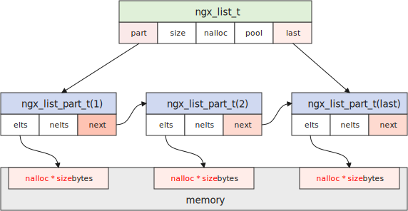

# 单向链表 - ngx_list_t

nginx的单向链表设计和 [ngx_array_t](nginx/data/ngx_array_t.md) 很相似。链表由多个节点组成, 每个节点其实是一个数组。所以nginx的单向链表其实就是一个更高级的动态数组。数组中的元素由不同的节点管理，与 [ngx_array_t](nginx/data/ngx_array_t.md) 相比，不需要保证数组中元素在内存中连续性。适用于那些数组元素数量不确定的场合。

## 数据结构定义

### 链表节点 - ngx_list_part_t

```c
/* 名词定义:
 * 链表节点: 一个 ngx_list_part_t 即 一个链表节点
 * 数组元素: 一个 ngx_list_part_t 管理了 ngx_list_t.nalloc 个数组元素
 */

typedef struct ngx_list_part_s  ngx_list_part_t;

/* 链表节点
 * 该结构管理了一个数组, 数组最多容纳 ngx_list_t.nalloc 个元素;所有元素在内存中是连续的
 * 每个数组元素的长度不能超过 ngx_list_t.size;超过了则破环了链表结构
 * 当成员nelts等于ngx_list_t.nalloc时,表示当前ngx_list_part_t管理的内存元素耗尽,需要再申请一个 ngx_list_part_t
*/
struct ngx_list_part_s {
    void             *elts; //该链表管理的内存的首地址,通过 elts + ((n-1) * ngx_list_t.size)即可计算第n个内存元素的首地址
    ngx_uint_t        nelts;//该链表已经使用了多少个内存元素, 最大值为 ngx_list_t.nalloc
    ngx_list_part_t  *next; //下一个链表节点的地址
};
```

### 链表管理结构 - ngx_list_t

```c
/* 链表管理结构
 * 由头节点 + 管理要素 组成
 */
typedef struct {
    ngx_list_part_t  *last;   //尾节点指针(last->next = NULL)
    ngx_list_part_t   part;   //首节点(注意不是指针)
    size_t            size;   //一个节点管理的(数组)内存的大小
    ngx_uint_t        nalloc; //一个节点管理的(数组)元素最大值
    ngx_pool_t       *pool;   //内存池对象, ngx_list_t 中所有的内存都是从pool中申请的
} ngx_list_t;
```

整体内存布局如下图:



## API 接口定义

### 单向链表管理结构初始化 - ngx_list_init

```c
static ngx_inline ngx_int_t
ngx_list_init(ngx_list_t *list, ngx_pool_t *pool, ngx_uint_t n, size_t size)
{
   /* 申请 首节点的数组内存 */
   list->part.elts = ngx_palloc(pool, n * size);
    if (list->part.elts == NULL) {
        return NGX_ERROR;
    }

    list->part.nelts = 0;
    list->part.next = NULL;
    list->last = &list->part;
    list->size = size;
    list->nalloc = n;
    list->pool = pool;

    return NGX_OK;
}
```

### 创建单向链表 - ngx_list_create

```c
/** 创建单向链表
 * 参数 p : 内存池
 * 参数 n : 一个链表节点含有数组的个数
 * 参数 size : 一个数组元素的大小, 
 * 注意一个节点管理的内存大小为 n * size
 */
ngx_list_t *
ngx_list_create(ngx_pool_t *pool, ngx_uint_t n, size_t size)
{
    ngx_list_t  *list;

    /* 申请管理结构内存 */
    list = ngx_palloc(pool, sizeof(ngx_list_t));
    if (list == NULL) {
        return NULL;
    }

    /* 申请首节数组内存,并初始化管理结构 */
    if (ngx_list_init(list, pool, n, size) != NGX_OK) {
        return NULL;
    }

    return list;
}
```

### 向单向链表中添加元素 - ngx_list_push

```c
/* 向链表中添加元素
 * 注意:这里的元素指的是一个节点中数组的一个元素
*/
void *
ngx_list_push(ngx_list_t *l)
{
    void             *elt;
    ngx_list_part_t  *last;

    last = l->last;

    /* 最后一个节点存储已满的情况 */
    if (last->nelts == l->nalloc) {
        /* 申请一个新的节点 */
        last = ngx_palloc(l->pool, sizeof(ngx_list_part_t));
        if (last == NULL) {
            return NULL;
        }

        last->elts = ngx_palloc(l->pool, l->nalloc * l->size);
        if (last->elts == NULL) {
            return NULL;
        }

        last->nelts = 0;
        last->next = NULL;

        l->last->next = last;
        l->last = last;
    }

    elt = (char *) last->elts + l->size * last->nelts;
    last->nelts++;

    return elt;
}
```

## 例子

```c
#include <ngx_config.h>
#include <ngx_core.h>
#include <ngx_list.h>

typedef void (*INTER_FUNC)(void);
static void _internal_handler_0(void){printf("%s\n", __FUNCTION__);}
static void _internal_handler_1(void){printf("%s\n", __FUNCTION__);}
static void _internal_handler_2(void){printf("%s\n", __FUNCTION__);}
static void _internal_handler_3(void){printf("%s\n", __FUNCTION__);}
static void _internal_handler_4(void){printf("%s\n", __FUNCTION__);}
static void _internal_handler_5(void){printf("%s\n", __FUNCTION__);}
static void _internal_handler_6(void){printf("%s\n", __FUNCTION__);}
static void _internal_handler_7(void){printf("%s\n", __FUNCTION__);}
static void _internal_handler_8(void){printf("%s\n", __FUNCTION__);}
static void _internal_handler_9(void){printf("%s\n", __FUNCTION__);}

static INTER_FUNC functbl[] = {
    _internal_handler_0,
    _internal_handler_1,
    _internal_handler_2,
    _internal_handler_3,
    _internal_handler_4,
    _internal_handler_5,
    _internal_handler_6,
    _internal_handler_7,
    _internal_handler_8,
    _internal_handler_9
};

int 
main(int argc, char *const *argv)
{
    unsigned int     i;
    ngx_pool_t      *pool;
    ngx_list_t      *list;
    ngx_list_part_t *part;
    INTER_FUNC      *func;


    pool = ngx_create_pool(1024 * 1024, NULL);
    if (pool == NULL) {
        return NGX_ERROR;
    }

    /* 创建单向链表 */
    list = ngx_list_create(pool, 2, sizeof(INTER_FUNC));
    if (list == NULL) {
        ngx_destroy_pool(pool);
        return NGX_ERROR;
    }

    /* 单向链表赋值 */
    for (i = 0; i < sizeof(functbl)/sizeof(INTER_FUNC); i++) {
        func = ngx_list_push(list);
        *func = functbl[i];
        //printf("[IN]list[%u] *%p = %p\n", i, func, functbl[i]);
    }

    /* 单向链表遍历 */
    part = &list->part;
    while(part) {
        /* 遍历一个节点 */
        func = part->elts;
        for (i = 0; i < part->nelts; i++) {
            //printf("[OUT]list[%u] *%p = %p\n", i, func + i, func[i]);
            func[i]();
        }

        /* 指向下一个节点 */
        part = part->next;
    }

    ngx_destroy_pool(pool);

    return 0;
}
```
