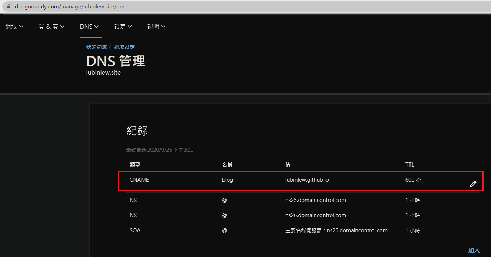
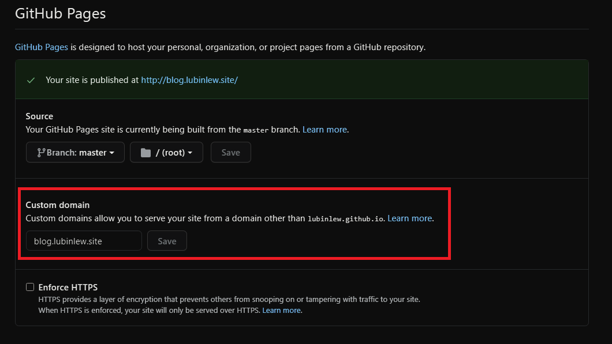
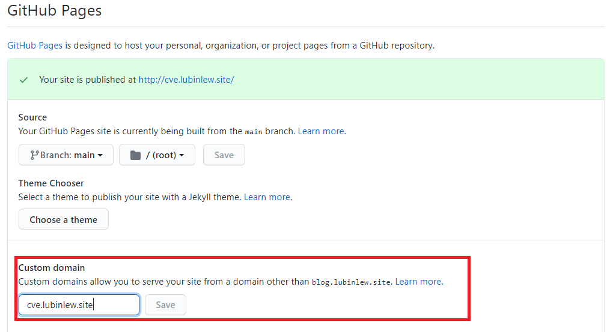

# 使用github搭建个人博客

## 建立博客仓库

仓库的名称必须为 `{username}.github.io`

## 设置个人域名

`{username}.github.io`这个域名如果你觉得不好记, 那么可以自己购买一个域名然后指向这个 github域名。

### 购买域名并设置CNAME

首先在服务提供商处购买一个域名， 比如我在godaddy上花15块大洋购买的 `lubinlew.site`。然后在这个域名的DNS设置处，增加一个指向github域名的CNAME。下面要做的是将 `blog.lubinlew.site` 映射到 `lubinlew.github.io`

PS:如果你想要将 `lubinlew.site` 这样的一级域名映射到 `lubinlew.github.io`, 增加`CNAME`时, 将`blog`换成 `www`即可.

### 配置github个人域名

在仓库的设置中配置 Github Pages 选项

### 其他repo对应CNAME

其他仓库发布git pages时, 默认就是 blog.lubinlew.site/`REPO-NAME`，当我们想要单独给其一个二级域名时， 配置方法与上面相同。例如我们有一个[GitHub - LubinLew/WEB-CVE: http/https CVE](https://github.com/LubinLew/WEB-CVE) 库, 想将其发布到 `cve.lubinlew.site`，按照下面的方法配置：

#### 配置CNAME

#### 配置github个人域名

